```r
# number of cases:
nrow(df)
```

```
## [1] 167
```
Our sample is based on 167 cases.

# Missing data


```r
library(visdat)
vis_dat(df)
```

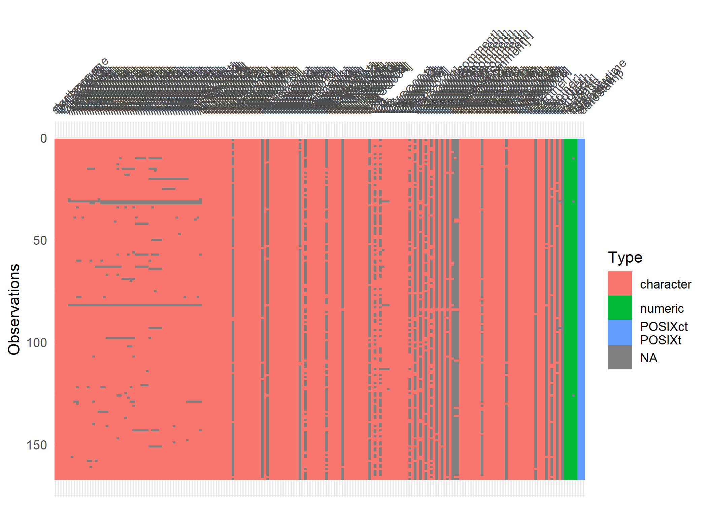<!-- -->

```r
visdat::vis_miss(df)
```

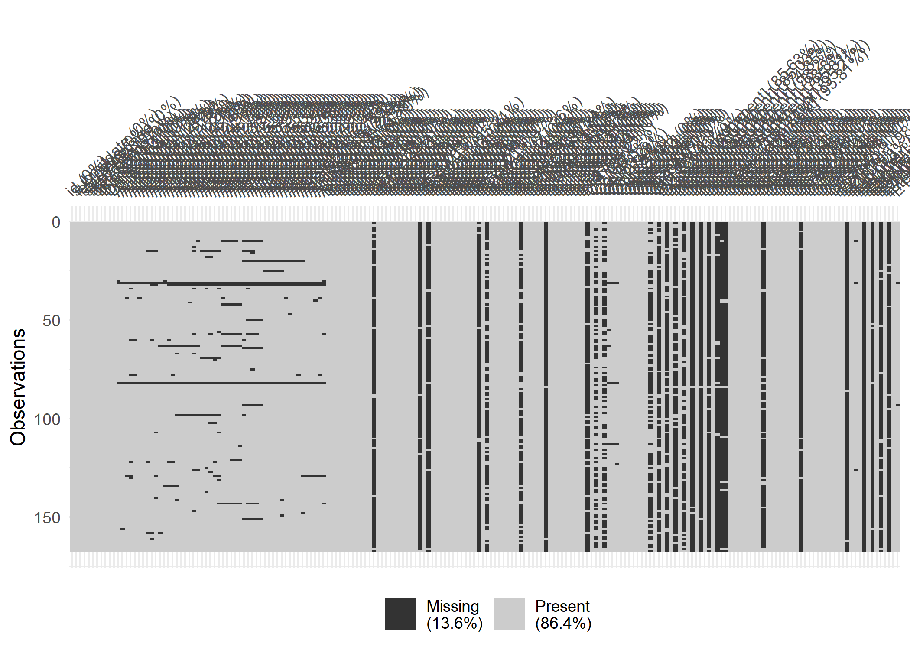<!-- -->


```r
df %>% 
  select_if(function(x) (sum(is.na(x)))/length(x) > .1) %>% 
  vis_miss()
```

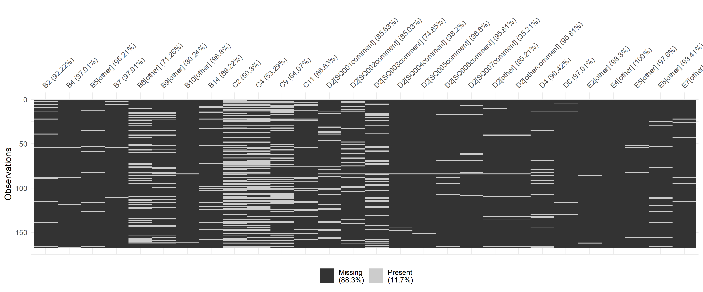<!-- -->

# Demographics

# Countries

In which country do you work? [drop-down/ open text]


```r
e1_rec_df <- df %>%
  select("E1_rec")

e1_rec_df %>%
plot_bar(E1_rec, title = "Countries", reorder = TRUE, nudge_y = .03)
```

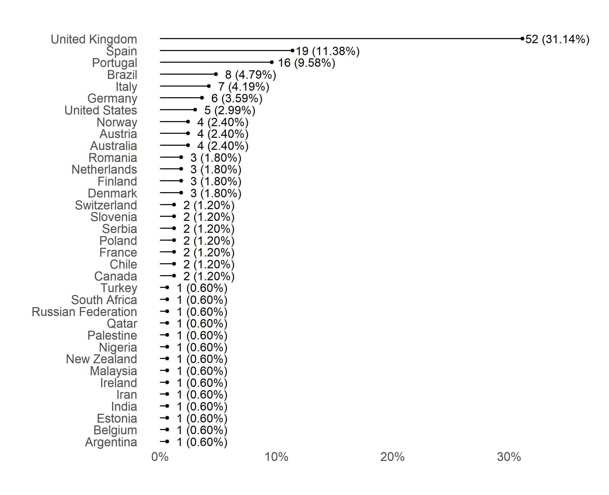<!-- -->


# Gender

Please select the gender category that best describes you


```r
answer_levels_e2 <- c("Man", "Woman", "Prefer not to say", "Other")

e2_df <- df %>% 
  select("E2")

e2_df_rec <- e2_df %>% 
  mutate(across(.fns = factor, levels = answer_levels_e2))


e2_df_rec %>% 
  plot_bar(E2, title = "Gender", reorder = TRUE, nudge_y = .079)
```

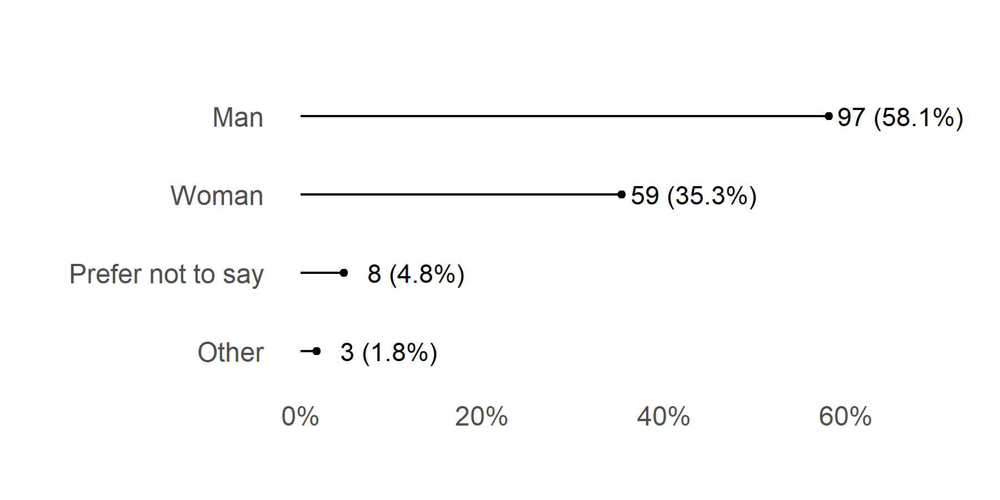<!-- -->


# Age cohorts

What is your age?


```r
answer_levels_e3 <- c("<20", "20-29", "30-39", "40-49", "50-59", "60-69", "70+")

e3_df <- df %>% 
  select("E3")

e3_df_rec <- e3_df %>% 
  mutate(across(.fns = factor, levels = answer_levels_e3))


e3_df_rec %>% 
  summarise(across(.fns = ~sum(is.na(.x))))
```

```
## # A tibble: 1 x 1
##      E3
##   <int>
## 1     0
```

```r
e3_df_rec %>%
  mutate(across(.fns = as.numeric)) %>% 
  summarise(across(everything(), ~mean(.x, na.rm = TRUE)))
```

```
## # A tibble: 1 x 1
##      E3
##   <dbl>
## 1  4.49
```

```r
e3_df_rec %>%
  plot_bar(E3, title = "Age cohorts", reorder = FALSE, nudge_y = .028)
```

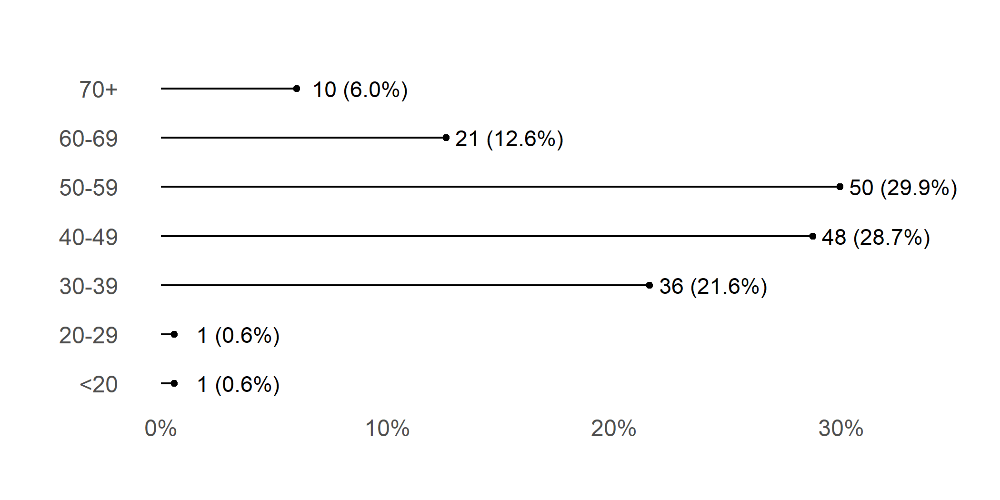<!-- -->

# Publish first academic publication

When did you publish your first academic publication (journal article, book, chapter, conference proceeding, or similar)? Please tell us the year.


```r
e3b_df <- df %>% 
  select("E3b") %>% 
  filter(E3b > 1960)

e3b_df %>% 
  plot_bar(E3b, title = "Publish first academic publication", reorder = FALSE, nudge_y = .009)
```

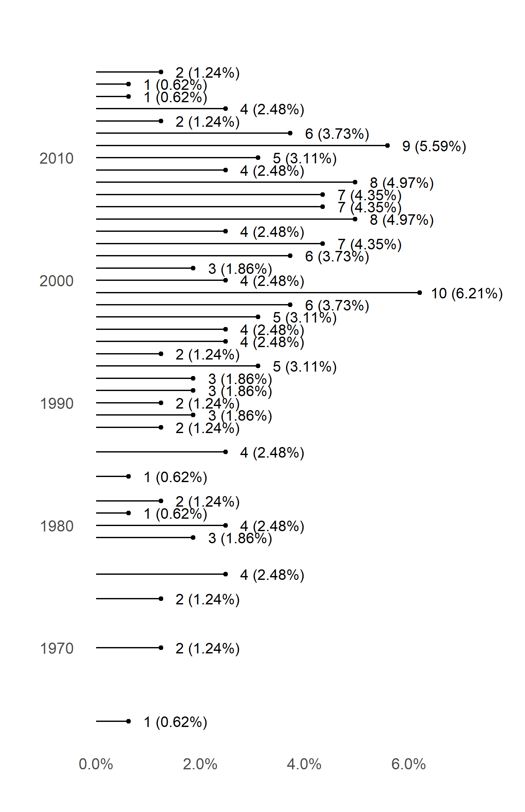<!-- -->


# Highest education

What is the highest education level you completed? [drop down]


```r
answer_levels_e4 <- c("Post-secondary non-tertiary education (e.g. VET Schools, schools of healthcare and nursing)", "Short-cycle tertiary education (e.g. master schools, colleges, vocational training schools)", "Bachelor or equivalent", "Master or equivalent", "Doctorate or equivalent", "Other")

answer_labels_e4 <- str_wrap(answer_levels_e4, 30)

e4_df <- df %>% 
  select("E4")

e4_df_rec <- e4_df %>% 
  mutate(across(.fns = factor, levels = answer_levels_e4, 
                labels = answer_labels_e4))

e4_df_rec %>%
  plot_bar(E4, title = "Highest education", reorder = FALSE, nudge_y = .2)
```

<!-- -->

# Types of institution

In what type of institution do you work? [drop down]


```r
answer_levels_e5 <- c("University", "Public research institute", "Private research institute", "Company", "Nonprofit", "Other")

e5_df <- df %>% 
  select("E5")

e5_df_rec <- e5_df %>% 
  mutate(across(.fns = factor, levels = answer_levels_e5))

e5_df_rec %>% 
  plot_bar(E5, title = "Types of institution", reorder = TRUE, nudge_y = .13)
```

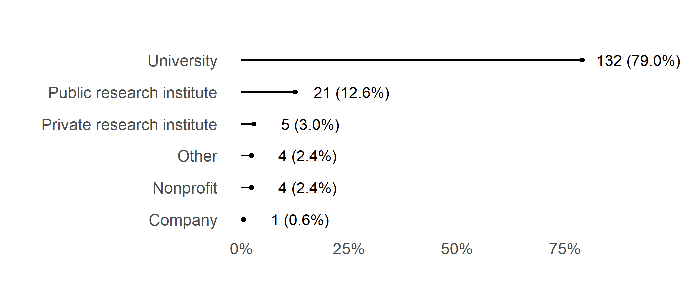<!-- -->

# Position

What is your position? Choose all that apply


```r
answer_levels_e6 <- c("Junior Researcher", "Senior Researcher", "Ph.D. student", "Postdoctoral fellow/ researcher", "Assistant professor", 
                      "Associate professor", "Full professor", "Associate research scientist", "Instructor", "Lecturer", "Adjunct professor", 
                      "Technician or lab manager", "Core facility manager", "Other")

e6_df <- df %>% 
  select("E6")

e6_df_rec <- e6_df %>% 
  mutate(across(.fns = factor, levels = answer_levels_e6))

e6_df_rec %>% 
  plot_bar(E6, title = "Position", reorder = TRUE, nudge_y = .035)
```

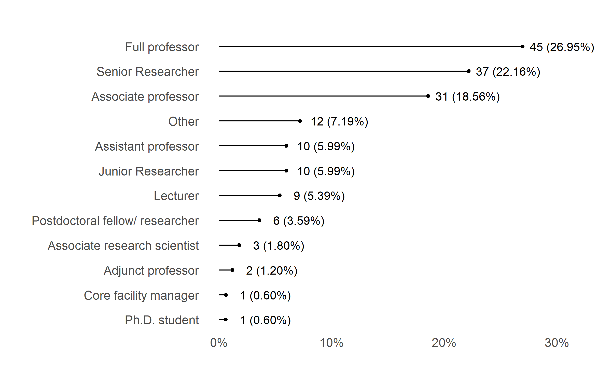<!-- -->

# Respondents by disciplines

In which general area of knowledge do you work?


```r
answer_levels_e7 <- c("Natural Sciences", "Engineering and technology", "Medical and health sciences", "Agricultural and Veterinary sciences", 
                      "Social Sciences", "Humanities and the Arts")

e7_df <- df %>% 
  select("E7")

e7_df_rec <- e7_df %>% 
  mutate(across(.fns = factor, levels = answer_levels_e7))

e7_df_rec %>% 
  plot_bar(E7, title = "Respondents by disciplines", reorder = TRUE, nudge_y = .055)
```

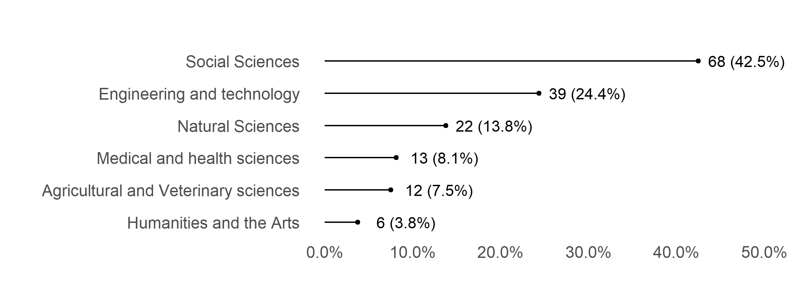<!-- -->


# A1 Practices in OS

Please rate the following statements according to your practices regarding Open Science


```r
answer_levels <- c("Strongly disagree", "Disagree", "Neither agree nor disagree",
                   "Agree", "Strongly agree", 
                   "This topic is not relevant to my research", 
                   "Don’t know/ Don’t have enough information")


a1_df <- df %>% 
  select(starts_with("A1[")) 

a1_df_rec <- a1_df %>% 
  mutate(across(.fns = factor, levels = answer_levels))


recode_successful(a1_df, a1_df_rec)
```

```
## [1] TRUE
```

```r
visdat::vis_miss(a1_df_rec)
```

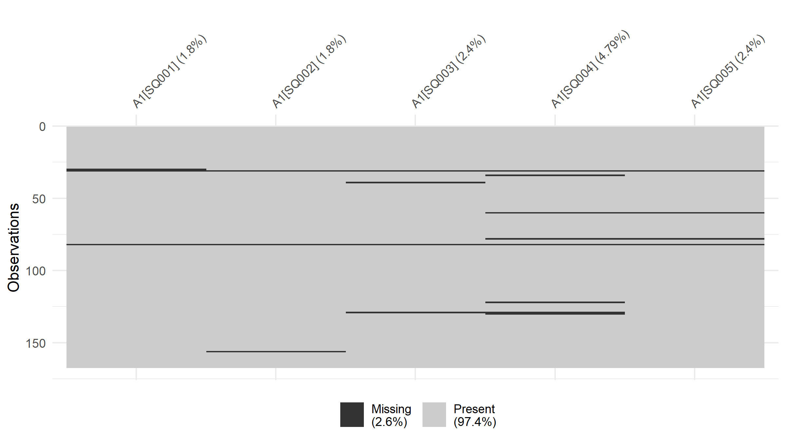<!-- -->

```r
a1_df_rec %>% 
  plot_likert()
```

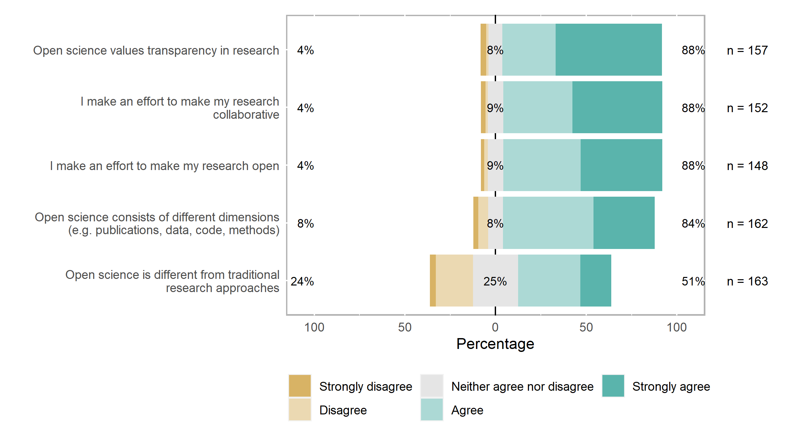<!-- -->


# A2 Own pratices regarding Open Access publishing

Please rate the following statements according to your own practices regarding Open Access publishing.


```r
answer_levels_2 <- c("Never", "Rarely", "Sometimes",
                   "Often", "Always", "This topic is not relevant to my research", 
                   "Don’t know/ Don’t have enough information")


a2_df <- df %>% 
  select(starts_with("A2[")) 

a2_df_rec <- a2_df %>% 
  mutate(across(.fns = factor, levels = answer_levels_2))


a2_df %>% 
  summarise(across(.fns = ~sum(is.na(.x))))
```

```
## # A tibble: 1 x 5
##   `A2[SQ001]` `A2[SQ002]` `A2[SQ003]` `A2[SQ004]` `A2[SQ005]`
##         <int>       <int>       <int>       <int>       <int>
## 1           3           2           5           7           7
```

```r
a2_df_rec %>% 
  plot_likert()
```

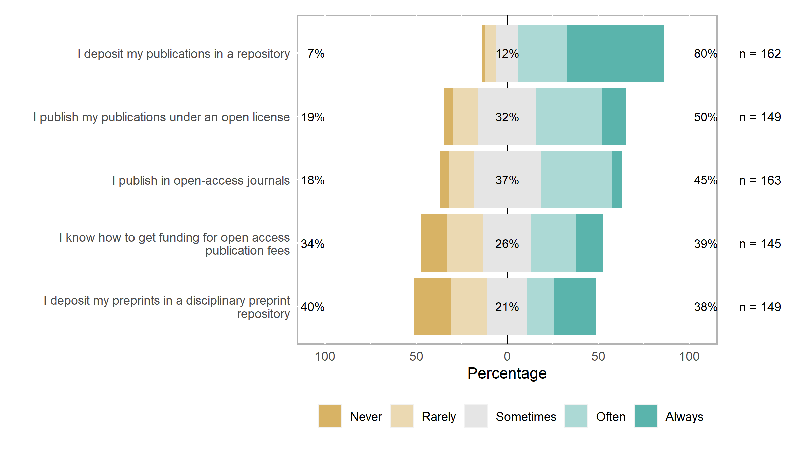<!-- -->


# A3 Own practices regarding Research Data Management

Please rate the following statements according to your own practices regarding Research Data Management.


```r
a3_df <- df %>% 
  select(starts_with("A3[")) 

a3_df_rec <- a3_df %>% 
  mutate(across(.fns = factor, levels = answer_levels_2))


a3_df %>% 
  summarise(across(.fns = ~sum(is.na(.x))))
```

```
## # A tibble: 1 x 5
##   `A3[SQ005]` `A3[SQ001]` `A3[SQ002]` `A3[SQ003]` `A3[SQ004]`
##         <int>       <int>       <int>       <int>       <int>
## 1           4           5           7           7           8
```

```r
a3_df_rec %>% 
  plot_likert()
```

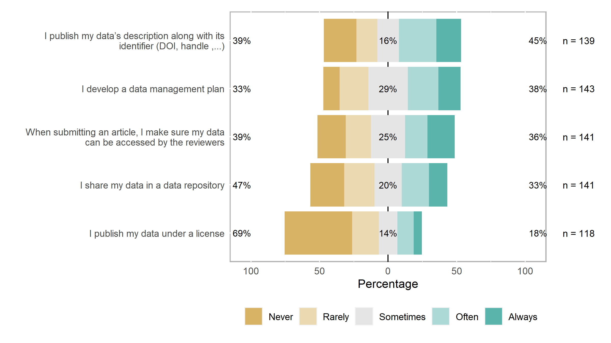<!-- -->


# A4 Practices regarding Reproducible Research

Please rate the following statements according to your practices regarding Reproducible Research


```r
a4_df <- df %>% 
  select(starts_with("A4[")) 

a4_df_rec <- a4_df %>% 
  mutate(across(.fns = factor, levels = answer_levels_2))


a4_df %>% 
  summarise(across(.fns = ~sum(is.na(.x))))
```

```
## # A tibble: 1 x 5
##   `A4[SQ001]` `A4[SQ002]` `A4[SQ003]` `A4[SQ004]` `A4[SQ005]`
##         <int>       <int>       <int>       <int>       <int>
## 1           5           5           6          12           7
```

```r
a4_df_rec %>% 
  plot_likert()
```

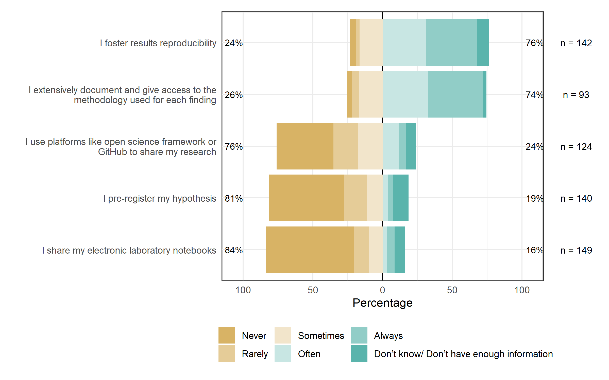<!-- -->


# A5 Pratices regarding Open Peer Review

Please rate the following statements according to your practices regarding Open Peer Review.


```r
answer_levels <- c("Strongly disagree", "Disagree", "Neither agree nor disagree",
                   "Agree", "Strongly agree", 
                   "This topic is not relevant to my research", 
                   "Don’t know/ Don’t have enough information")


a5_df <- df %>% 
  select(starts_with("A5[")) 

a5_df_rec <- a5_df %>% 
  mutate(across(.fns = factor, levels = answer_levels))


a5_df %>% 
  summarise(across(.fns = ~sum(is.na(.x))))
```

```
## # A tibble: 1 x 5
##   `A5[SQ001]` `A5[SQ002]` `A5[SQ003]` `A5[SQ004]` `A5[SQ005]`
##         <int>       <int>       <int>       <int>       <int>
## 1           6          10          10          10          12
```

```r
a5_df_rec %>% 
  plot_likert()
```

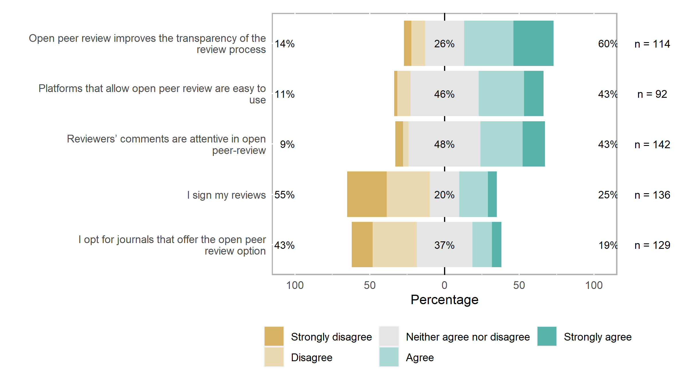<!-- -->


# A6 Practices regarding Open Source Software

Please rate the following statements according to your practices regarding Open Source Software.


```r
a6_df <- df %>% 
  select(starts_with("A6[")) 

a6_df_rec <- a6_df %>% 
  mutate(across(.fns = factor, levels = answer_levels_2))


a6_df %>% 
  summarise(across(.fns = ~sum(is.na(.x))))
```

```
## # A tibble: 1 x 5
##   `A6[SQ001]` `A6[SQ002]` `A6[SQ003]` `A6[SQ004]` `A6[SQ005]`
##         <int>       <int>       <int>       <int>       <int>
## 1           9           8           9           9           9
```

```r
a6_df_rec %>% 
  plot_likert()
```

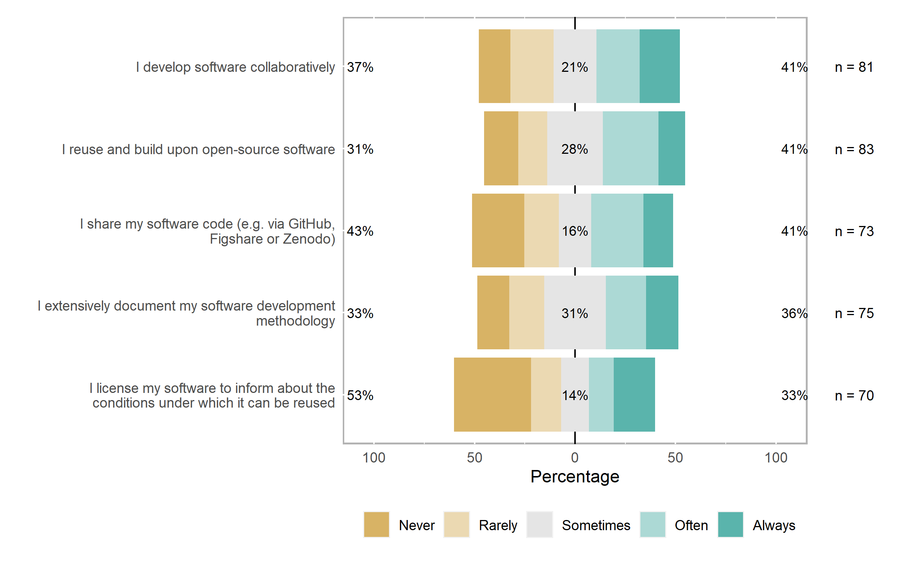<!-- -->


# A7 Practices regarding Licensing

Please rate the following statements according to your practices regarding Licensing.


```r
a7_df <- df %>% 
  select(starts_with("A7[")) 

a7_df_rec <- a7_df %>% 
  mutate(across(.fns = factor, levels = answer_levels))


a7_df %>% 
  summarise(across(.fns = ~sum(is.na(.x))))
```

```
## # A tibble: 1 x 5
##   `A7[SQ001]` `A7[SQ002]` `A7[SQ003]` `A7[SQ004]` `A7[SQ005]`
##         <int>       <int>       <int>       <int>       <int>
## 1          11          13          14          11           9
```

```r
a7_df_rec %>% 
  plot_likert()
```

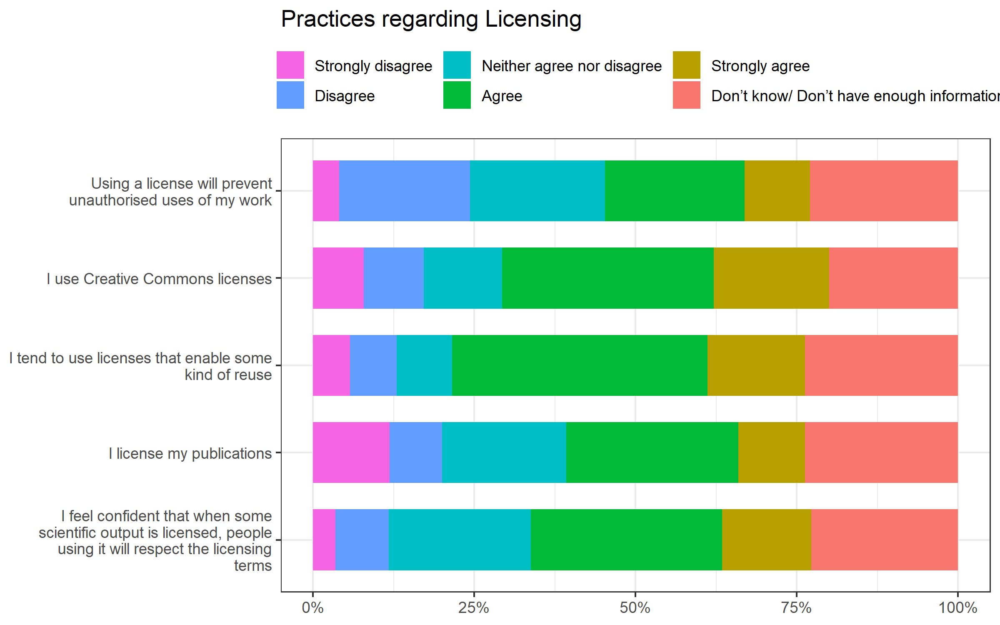<!-- -->


# A8 Practices regarding Research Integrity

Please rate the following statements according to your practices regarding Research Integrity


```r
a8_df <- df %>% 
  select(starts_with("A8[")) 

a8_df_rec <- a8_df %>% 
  mutate(across(.fns = factor, levels = answer_levels_2))


a8_df %>% 
  summarise(across(.fns = ~sum(is.na(.x))))
```

```
## # A tibble: 1 x 5
##   `A8[SQ001]` `A8[SQ002]` `A8[SQ003]` `A8[SQ004]` `A8[SQ005]`
##         <int>       <int>       <int>       <int>       <int>
## 1           5           5           5           5           7
```

```r
a8_df_rec %>% 
  plot_likert()
```

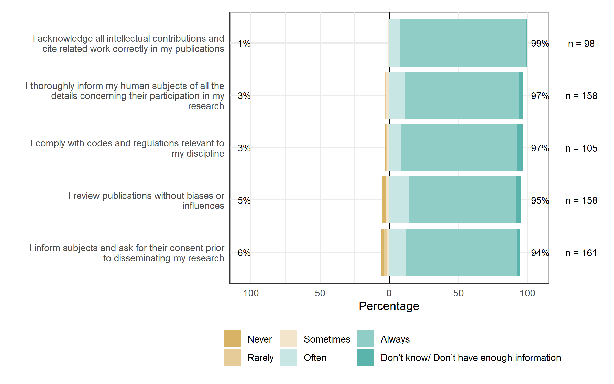<!-- -->


# A9 Practices regarding Citizen Science (information, consultation, public participation)

Please rate the following statements according to your practices regarding Citizen Science - consider all levels -information, consultation, public participation


```r
a9_df <- df %>% 
  select(starts_with("A9[")) 

a9_df_rec <- a9_df %>% 
  mutate(across(.fns = factor, levels = answer_levels))


a9_df %>% 
  summarise(across(.fns = ~sum(is.na(.x))))
```

```
## # A tibble: 1 x 5
##   `A9[SQ001]` `A9[SQ002]` `A9[SQ003]` `A9[SQ004]` `A9[SQ005]`
##         <int>       <int>       <int>       <int>       <int>
## 1           5           5           4           5           6
```

```r
a9_df_rec %>% 
  plot_likert()
```

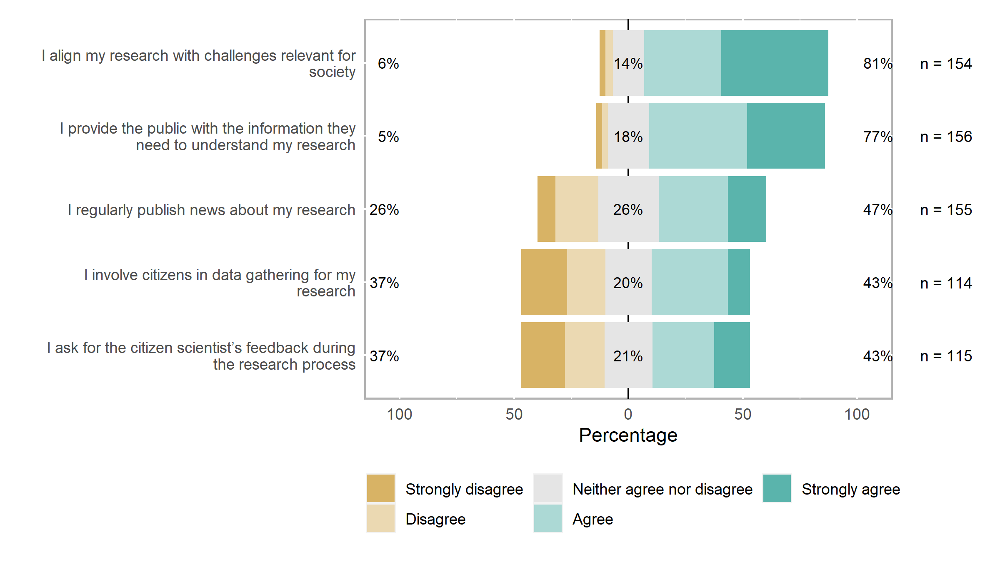<!-- -->


# A10 Practices regarding Gender Issue

Please rate the following statements according to your practices regarding Gender issues


```r
a10_df <- df %>% 
  select(starts_with("A10[")) 

a10_df_rec <- a10_df %>% 
  mutate(across(.fns = factor, levels = answer_levels))


a10_df %>% 
  summarise(across(.fns = ~sum(is.na(.x))))
```

```
## # A tibble: 1 x 5
##   `A10[SQ001]` `A10[SQ002]` `A10[SQ003]` `A10[SQ004]` `A10[SQ005]`
##          <int>        <int>        <int>        <int>        <int>
## 1            4            4            5            6            7
```

```r
a10_df_rec %>% 
  plot_likert()
```

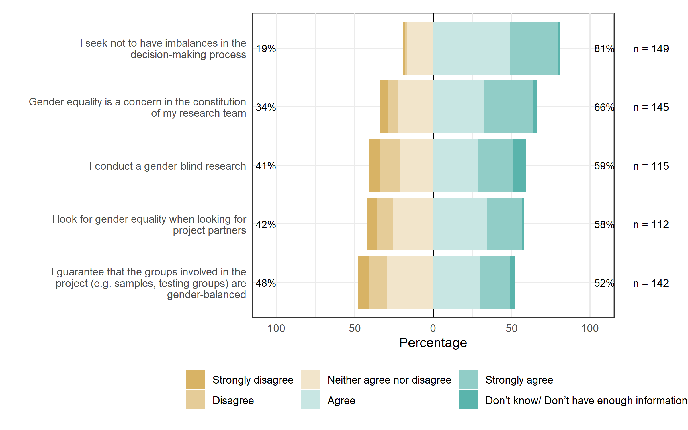<!-- -->

# Part B Training on OS topics

# B1 Attended Training Events

How many training events have you attended in these topics?


```r
answer_levels_b1 <- c("None", "1", "2", "3-5", "more than 5")


b1_df <- df %>% 
  select(starts_with("B1[")) 

b1_df_rec <- b1_df %>% 
  mutate(across(.fns = factor, levels = answer_levels_b1))


b1_df %>% 
  summarise(across(.fns = ~sum(is.na(.x))))
```

```
## # A tibble: 1 x 11
##   `B1[SQ001]` `B1[SQ002]` `B1[SQ003]` `B1[SQ004]` `B1[SQ005]` `B1[SQ006]`
##         <int>       <int>       <int>       <int>       <int>       <int>
## 1           0           0           0           0           0           0
## # ... with 5 more variables: B1[SQ007] <int>, B1[SQ008] <int>, B1[SQ009] <int>,
## #   B1[SQ010] <int>, B1[SQ013] <int>
```

```r
b1_df_rec %>% 
  plot_likert()
```

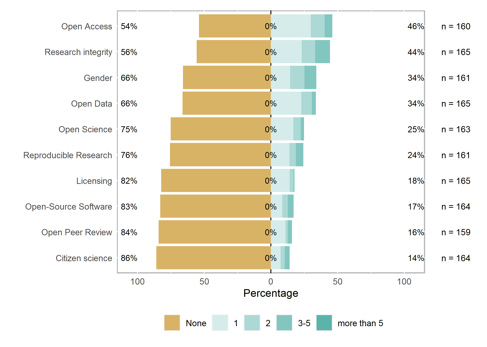<!-- -->


# B3 Attended Different Types of Training Sessions

How often did you attend the following types of training sessions?


```r
answer_levels_b3 <- c("Never", "Once", "More than once")


b3_df <- df %>% 
  select(starts_with("B3[")) 

b3_df_rec <- b3_df %>% 
  mutate(across(.fns = factor, levels = answer_levels_b3))


b3_df_rec %>% 
  summarise(across(.fns = ~sum(is.na(.x))))
```

```
## # A tibble: 1 x 10
##   `B3[SQ001]` `B3[SQ002]` `B3[SQ003]` `B3[SQ004]` `B3[SQ005]` `B3[SQ006]`
##         <int>       <int>       <int>       <int>       <int>       <int>
## 1           0           0           0           0           0           0
## # ... with 4 more variables: B3[SQ007] <int>, B3[SQ008] <int>, B3[SQ009] <int>,
## #   B3[SQ013] <int>
```

```r
b3_df_rec %>% 
  plot_likert()
```

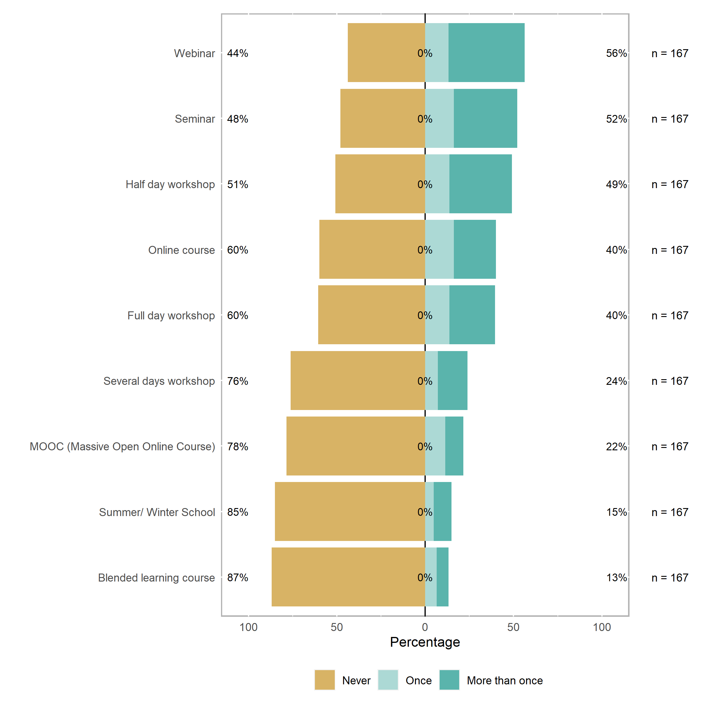<!-- -->


# B5 Hours of training

How many hours of training in total did you get?


```r
answer_levels_b5 <- c("None", "1", "2", "3-5", "More than 5", "Other")

b5_df <- df %>% 
  select("B5")

b5_df_rec <- b5_df %>% 
  mutate(across(.fns = factor, levels = answer_levels_b5))

recode_successful(b5_df, b5_df_rec)
```

```
## [1] TRUE
```

```r
b5_df_rec %>% 
  plot_bar(B5, title = "Hours of training", reorder = FALSE, nudge_y = .1)
```

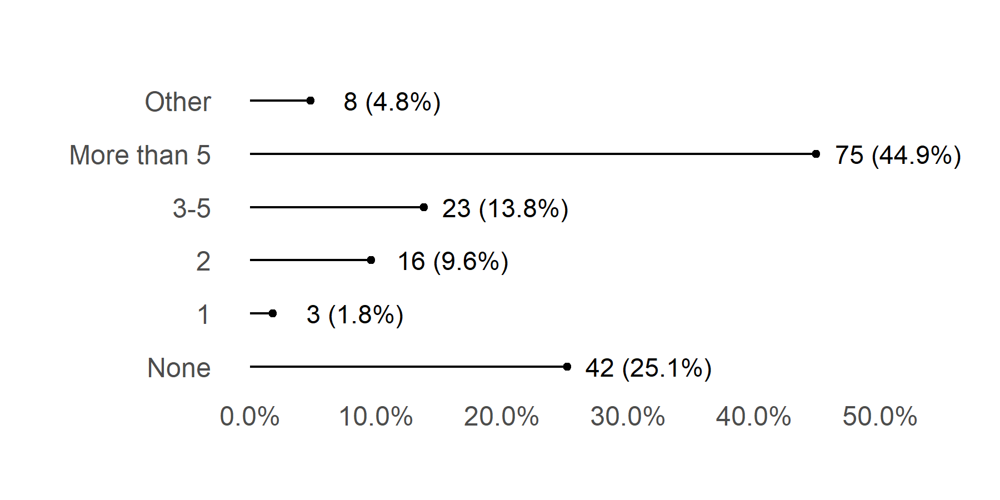<!-- -->


# B6 Attended Different Types of Training Sessions

Did the training you receive fulfill your needs?


```r
answer_levels_b6 <- c("I didn’t receive training", "I need more training", 
                        "I received adequate training", "This topic is not relevant for my research")


b6_df <- df %>% 
  select(starts_with("B6[")) 

b6_df_rec <- b6_df %>% 
  mutate(across(.fns = factor, levels = answer_levels_b6))


b6_df_rec %>% 
  summarise(across(.fns = ~sum(is.na(.x))))
```

```
## # A tibble: 1 x 11
##   `B6[SQ001]` `B6[SQ002]` `B6[SQ003]` `B6[SQ004]` `B6[SQ005]` `B6[SQ006]`
##         <int>       <int>       <int>       <int>       <int>       <int>
## 1           0           0           0           0           0           0
## # ... with 5 more variables: B6[SQ007] <int>, B6[SQ008] <int>, B6[SQ009] <int>,
## #   B6[SQ010] <int>, B6[SQ013] <int>
```

```r
b6_df_rec %>% 
  plot_likert()
```

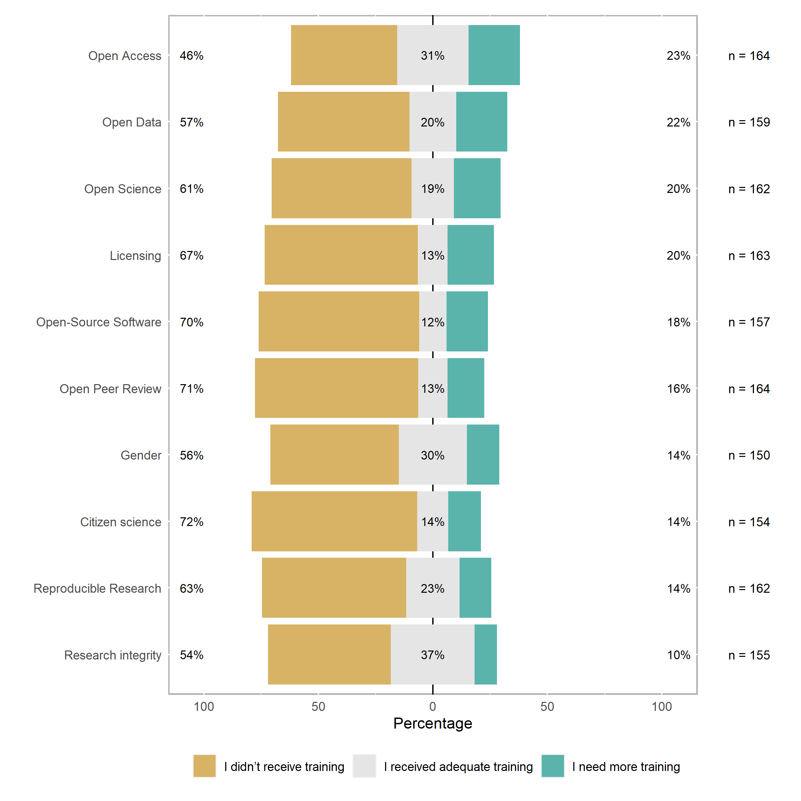<!-- -->


# B8 Attendance of first formal training in any Open Science topic

When did you attend your first formal training in any Open Science topic?


```r
answer_levels_b8 <- c("During doctoral studies", "As a researcher", "During a conference", "Other")

b8_df <- df %>% 
  select("B8")

b8_df_rec <- b8_df %>% 
  mutate(across(.fns = factor, levels = answer_levels_b8))


b8_df_rec %>% 
  plot_bar(B8, title = "Attendance of first formal training in any Open Science topic", reorder = FALSE, nudge_y = .08)
```

<!-- -->


Most responses from the "Other" category mention that they never received any
training.

# B9 Provider of attended training sessions

Who provided the training sessions you attended? (choose all that apply)


```r
answer_levels_3 <- c("Yes", "No")

b9_df <- df %>% 
  select(starts_with("B9[")) 

b9_df_rec <- b9_df %>% 
  mutate(across(.fns = factor, levels = answer_levels_3))


b9_df_rec %>% 
  plot_likert()
```

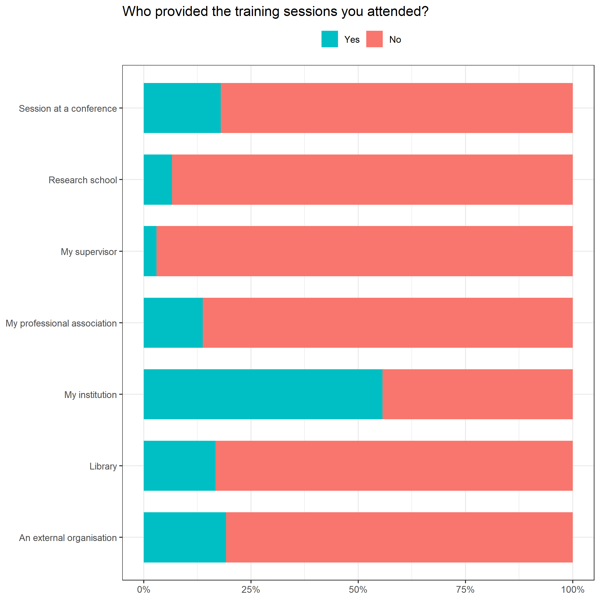<!-- -->


# B10 Preferred way to learn OS topics

What is your preferred way to learn open science topics? (choose all that apply)


```r
b10_df <- df %>% 
  select(starts_with("B10["))

b10_df_rec <- b10_df %>% 
  mutate(across(.fns = factor, levels = answer_levels_3))


b10_df_rec %>% 
  plot_likert()
```

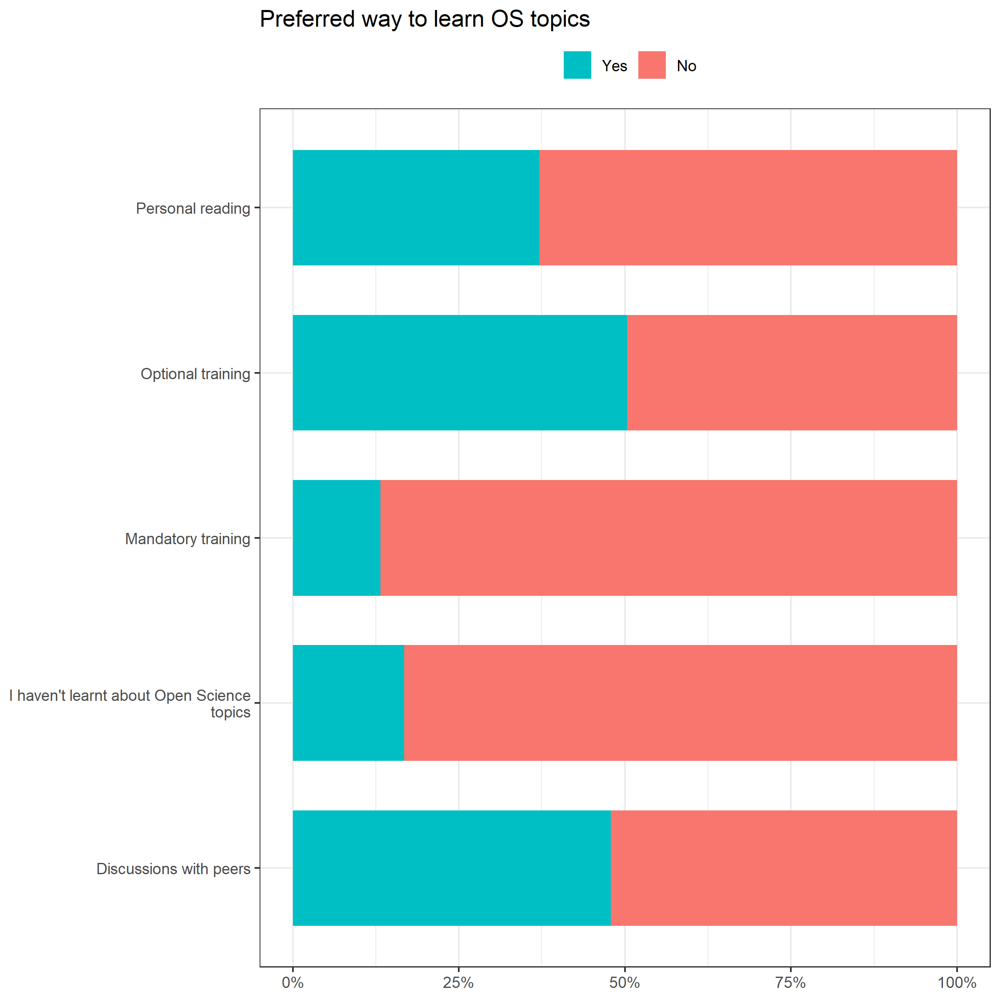<!-- -->


# B11 Has your awareness of open science practices increased after the training you attended?

Has your awareness of open science practices increased after the training you attended?


```r
answer_levels_4 <- c("Don’t know", "Highly disagree", "Disagree",
                     "Neither agree nor disagree",
                     "Agree", "Highly agree")


b11_df <- df %>% 
  select(starts_with("B11[")) 

b11_df_rec <- b11_df %>% 
  mutate(across(.fns = factor, levels = answer_levels_4))

recode_successful(b11_df, b11_df_rec)
```

```
## [1] TRUE
```

```r
b11_df_rec %>% 
  plot_likert()
```

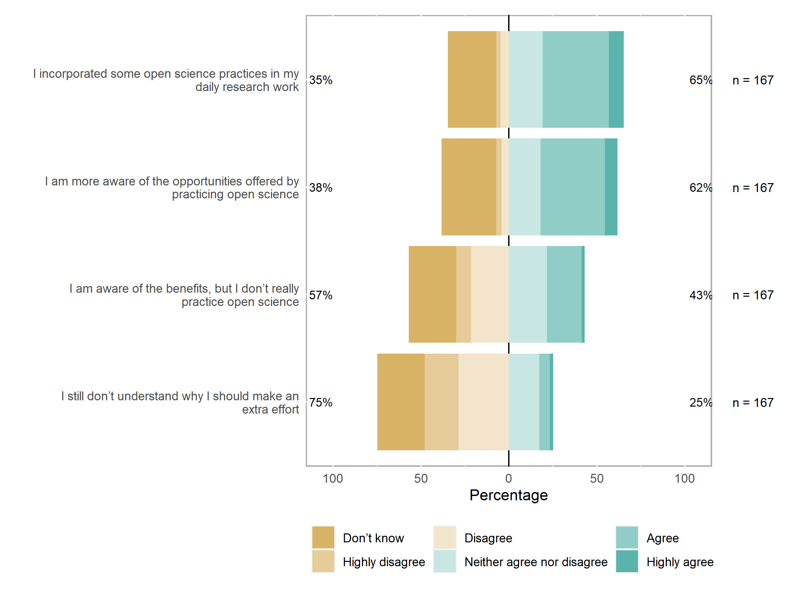<!-- -->


# B12 Share experience OS practices/tool with colleagues

Would you share your experience with open science practices and tools with colleagues?


```r
b12_df <- df %>% 
  select(starts_with("B12[")) 

b12_df_rec <- b12_df %>% 
  mutate(across(.fns = factor, levels = answer_levels_4))


b12_df_rec %>% 
  summarise(across(.fns = ~sum(is.na(.x))))
```

```
## # A tibble: 1 x 4
##   `B12[SQ001]` `B12[SQ002]` `B12[SQ003]` `B12[SQ004]`
##          <int>        <int>        <int>        <int>
## 1            0            0            0            0
```

```r
b12_df_rec %>% 
  plot_likert()
```

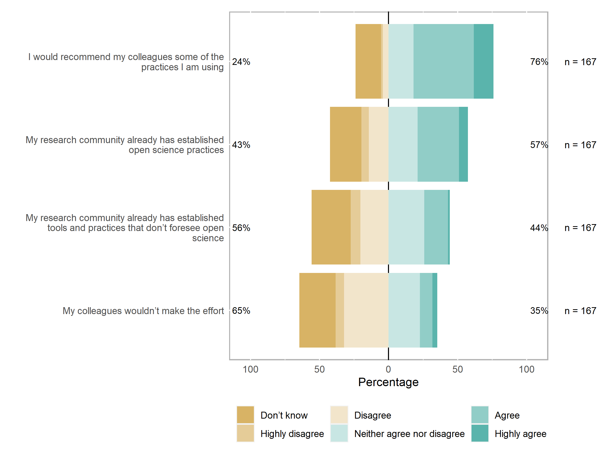<!-- -->


# Further todos

- check out cases with weird first year of publication `df %>% filter(id %in% c(356, 420, 129))` 


