```r
# number of cases:
nrow(df)
```

```
## [1] 167
```
Our sample is based on 167 cases.

# Missing data


```r
library(visdat)
vis_dat(df)
```

<!-- -->

```r
visdat::vis_miss(df)
```

<!-- -->


```r
df %>% 
  select_if(function(x) (sum(is.na(x)))/length(x) > .1) %>% 
  vis_miss()
```

<!-- -->

# Demographics

# Countries

In which country do you work? [drop-down/ open text]


```r
e1_rec_df <- df %>%
  select("E1_rec")

e1_rec_df %>%
  mutate(E1_rec = forcats::fct_lump_min(E1_rec, min = 4, other_level = "Other")) %>%
  plot_bar(E1_rec, title = "Countries", reorder = TRUE, nudge_y = .03)
```

```
## Registered S3 methods overwritten by 'ggalt':
##   method                  from   
##   grid.draw.absoluteGrob  ggplot2
##   grobHeight.absoluteGrob ggplot2
##   grobWidth.absoluteGrob  ggplot2
##   grobX.absoluteGrob      ggplot2
##   grobY.absoluteGrob      ggplot2
```

<!-- -->


# Gender

Please select the gender category that best describes you


```r
answer_levels_e2 <- c("Man", "Woman", "Prefer not to say", "Other")

e2_df <- df %>% 
  select("E2")

e2_df_rec <- e2_df %>% 
  mutate(across(.fns = factor, levels = answer_levels_e2))


e2_df_rec %>% 
  plot_bar(E2, title = "Gender", reorder = TRUE, nudge_y = .079)
```

<!-- -->


# Age cohorts

What is your age?


```r
answer_levels_e3 <- c("<20", "20-29", "30-39", "40-49", "50-59", "60-69", "70+")

e3_df <- df %>% 
  select("E3")

e3_df_rec <- e3_df %>% 
  mutate(across(.fns = factor, levels = answer_levels_e3))


e3_df_rec %>%
  mutate(across(.fns = as.numeric)) %>% 
  summarise(across(everything(), ~mean(.x, na.rm = TRUE)))
```

```
## # A tibble: 1 x 1
##      E3
##   <dbl>
## 1  4.49
```

```r
e3_df_rec %>%
  plot_bar(E3, title = "Age cohorts", reorder = FALSE, nudge_y = .028)
```

<!-- -->

# Publish first academic publication

When did you publish your first academic publication (journal article, book, chapter, conference proceeding, or similar)? Please tell us the year.


```r
e3b_df <- df %>% 
  select("E3b") %>% 
  filter(E3b > 1960)

e3b_df %>% 
  ggplot(aes(E3b)) +
  geom_histogram() +
  labs(x = NULL, y = NULL, title = NULL) +
  hrbrthemes::theme_ipsum(base_family = "Hind")
```

```
## `stat_bin()` using `bins = 30`. Pick better value with `binwidth`.
```

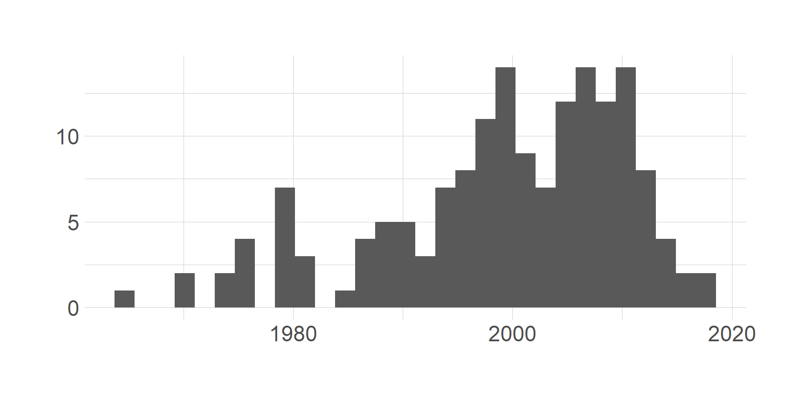<!-- -->


# Highest education

What is the highest education level you completed? [drop down]


```r
answer_levels_e4 <- c("Post-secondary non-tertiary education (e.g. VET Schools, schools of healthcare and nursing)", "Short-cycle tertiary education (e.g. master schools, colleges, vocational training schools)", "Bachelor or equivalent", "Master or equivalent", "Doctorate or equivalent", "Other")

answer_labels_e4 <- str_wrap(answer_levels_e4, 30)

e4_df <- df %>% 
  select("E4")

e4_df_rec <- e4_df %>% 
  mutate(across(.fns = factor, levels = answer_levels_e4, 
                labels = answer_labels_e4))

e4_df_rec %>%
  plot_bar(E4, title = "Highest education", reorder = FALSE, nudge_y = .2) +
  scale_y_continuous(breaks = c(0, .25, .5, .75, 1), 
                     labels = function(x) scales::percent(x, accuracy = 1))
```

```
## Scale for 'y' is already present. Adding another scale for 'y', which will
## replace the existing scale.
```

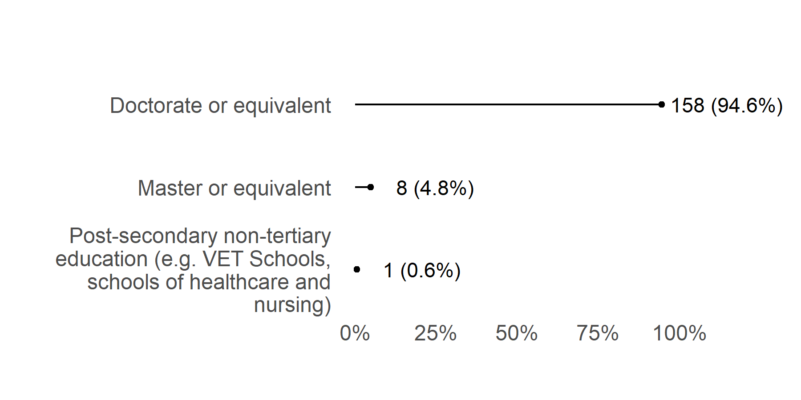<!-- -->

# Types of institution

In what type of institution do you work? [drop down]


```r
answer_levels_e5 <- c("University", "Public research institute", "Private research institute", "Company", "Nonprofit", "Other")

e5_df <- df %>% 
  select("E5")

e5_df_rec <- e5_df %>% 
  mutate(across(.fns = factor, levels = answer_levels_e5))

e5_df_rec %>% 
  plot_bar(E5, title = "Types of institution", reorder = TRUE, nudge_y = .13)
```

<!-- -->

# Position

What is your position? Choose all that apply


```r
answer_levels_e6 <- c("Junior Researcher", "Senior Researcher", "Ph.D. student", "Postdoctoral fellow/ researcher", "Assistant professor", 
                      "Associate professor", "Full professor", "Associate research scientist", "Instructor", "Lecturer", "Adjunct professor", 
                      "Technician or lab manager", "Core facility manager", "Other")

e6_df <- df %>% 
  select("E6")

e6_df_rec <- e6_df %>% 
  mutate(across(.fns = factor, levels = answer_levels_e6))

e6_df_rec %>% 
  plot_bar(E6, title = "Position", reorder = TRUE, nudge_y = .035)
```

<!-- -->

# Respondents by disciplines

In which general area of knowledge do you work?


```r
answer_levels_e7 <- c("Natural Sciences", "Engineering and technology", "Medical and health sciences", "Agricultural and Veterinary sciences", 
                      "Social Sciences", "Humanities and the Arts")

e7_df <- df %>% 
  select("E7")

e7_df_rec <- e7_df %>% 
  mutate(across(.fns = factor, levels = answer_levels_e7))

e7_df_rec %>% 
  plot_bar(E7, title = "Respondents by disciplines", reorder = TRUE, nudge_y = .055)
```

<!-- -->


# A1 Practices in OS

Please rate the following statements according to your practices regarding Open Science


```r
answer_levels <- c("Strongly disagree", "Disagree", "Neither agree nor disagree",
                   "Agree", "Strongly agree", 
                   "This topic is not relevant to my research", 
                   "Don’t know/ Don’t have enough information")


a1_df <- df %>% 
  select(starts_with("A1[")) 

a1_df_rec <- a1_df %>% 
  mutate(across(.fns = factor, levels = answer_levels))


recode_successful(a1_df, a1_df_rec)
```

[1] TRUE

```r
visdat::vis_miss(a1_df_rec)
```

<!-- -->

```r
a1_df_rec %>% 
  plot_likert()
```


|Variable                                                                               |Strongly disagree |Disagree   |Neither agree nor disagree |Agree      |Strongly agree |
|:--------------------------------------------------------------------------------------|:-----------------|:----------|:--------------------------|:----------|:--------------|
|I make an effort to make my research collaborative                                     |4 (2.5%)          |2 (1.2%)   |14 (8.6%)                  |62 (38.0%) |81 (49.7%)     |
|I make an effort to make my research open                                              |3 (1.9%)          |3 (1.9%)   |14 (8.6%)                  |69 (42.6%) |73 (45.1%)     |
|Open science consists of different dimensions (e.g. publications, data, code, methods) |4 (2.7%)          |8 (5.4%)   |12 (8.1%)                  |74 (50.0%) |50 (33.8%)     |
|Open science is different from traditional research approaches                         |5 (3.3%)          |31 (20.4%) |38 (25.0%)                 |52 (34.2%) |26 (17.1%)     |
|Open science values transparency in research                                           |5 (3.2%)          |2 (1.3%)   |12 (7.6%)                  |46 (29.3%) |92 (58.6%)     |


<!-- -->


# A2 Own practices regarding Open Access publishing

Please rate the following statements according to your own practices regarding Open Access publishing.


```r
answer_levels_2 <- c("Never", "Rarely", "Sometimes",
                   "Often", "Always", "This topic is not relevant to my research", 
                   "Don’t know/ Don’t have enough information")


a2_df <- df %>% 
  select(starts_with("A2[")) 

a2_df_rec <- a2_df %>% 
  mutate(across(.fns = factor, levels = answer_levels_2))

a2_df_rec %>% 
  plot_likert(legend_rows = 1)
```


|Variable                                                     |Never      |Rarely     |Sometimes  |Often      |Always     |
|:------------------------------------------------------------|:----------|:----------|:----------|:----------|:----------|
|I deposit my preprints in a disciplinary preprint repository |30 (20.1%) |30 (20.1%) |32 (21.5%) |22 (14.8%) |35 (23.5%) |
|I deposit my publications in a repository                    |2 (1.2%)   |10 (6.2%)  |20 (12.3%) |43 (26.5%) |87 (53.7%) |
|I know how to get funding for open access publication fees   |21 (14.5%) |29 (20.0%) |38 (26.2%) |36 (24.8%) |21 (14.5%) |
|I publish in open-access journals                            |8 (4.9%)   |22 (13.5%) |60 (36.8%) |64 (39.3%) |9 (5.5%)   |
|I publish my publications under an open license              |7 (4.7%)   |21 (14.1%) |47 (31.5%) |54 (36.2%) |20 (13.4%) |


<!-- -->


# A3 Own practices regarding Research Data Management

Please rate the following statements according to your own practices regarding Research Data Management.


```r
a3_df <- df %>% 
  select(starts_with("A3[")) 

a3_df_rec <- a3_df %>% 
  mutate(across(.fns = factor, levels = answer_levels_2))

a3_df_rec %>% 
  plot_likert(legend_rows = 1)
```


|Variable                                                                         |Never      |Rarely     |Sometimes  |Often      |Always     |
|:--------------------------------------------------------------------------------|:----------|:----------|:----------|:----------|:----------|
|I develop a data management plan                                                 |17 (11.9%) |30 (21.0%) |41 (28.7%) |32 (22.4%) |23 (16.1%) |
|I publish my data under a license                                                |58 (49.2%) |23 (19.5%) |16 (13.6%) |14 (11.9%) |7 (5.9%)   |
|I publish my data’s description along with its identifier (DOI, handle ,...)     |33 (23.7%) |21 (15.1%) |22 (15.8%) |38 (27.3%) |25 (18.0%) |
|I share my data in a data repository                                             |35 (24.8%) |31 (22.0%) |28 (19.9%) |28 (19.9%) |19 (13.5%) |
|When submitting an article, I make sure my data can be accessed by the reviewers |29 (20.6%) |26 (18.4%) |35 (24.8%) |23 (16.3%) |28 (19.9%) |


<!-- -->


# A4 Practices regarding Reproducible Research

Please rate the following statements according to your practices regarding Reproducible Research


```r
a4_df <- df %>% 
  select(starts_with("A4[")) 

a4_df_rec <- a4_df %>% 
  mutate(across(.fns = factor, levels = answer_levels_2))

a4_df_rec %>% 
  plot_likert(legend_rows = 1)
```


|Variable                                                                        |Never      |Rarely     |Sometimes  |Often      |Always     |
|:-------------------------------------------------------------------------------|:----------|:----------|:----------|:----------|:----------|
|I extensively document and give access to the methodology used for each finding |5 (3.4%)   |8 (5.5%)   |25 (17.2%) |49 (33.8%) |58 (40.0%) |
|I foster results reproducibility                                                |6 (4.7%)   |4 (3.1%)   |23 (18.0%) |44 (34.4%) |51 (39.8%) |
|I pre-register my hypothesis                                                    |67 (60.9%) |20 (18.2%) |14 (12.7%) |5 (4.5%)   |4 (3.6%)   |
|I share my electronic laboratory notebooks                                      |59 (68.6%) |10 (11.6%) |9 (10.5%)  |3 (3.5%)   |5 (5.8%)   |
|I use platforms like open science framework or GitHub to share my research      |58 (43.9%) |25 (18.9%) |25 (18.9%) |17 (12.9%) |7 (5.3%)   |


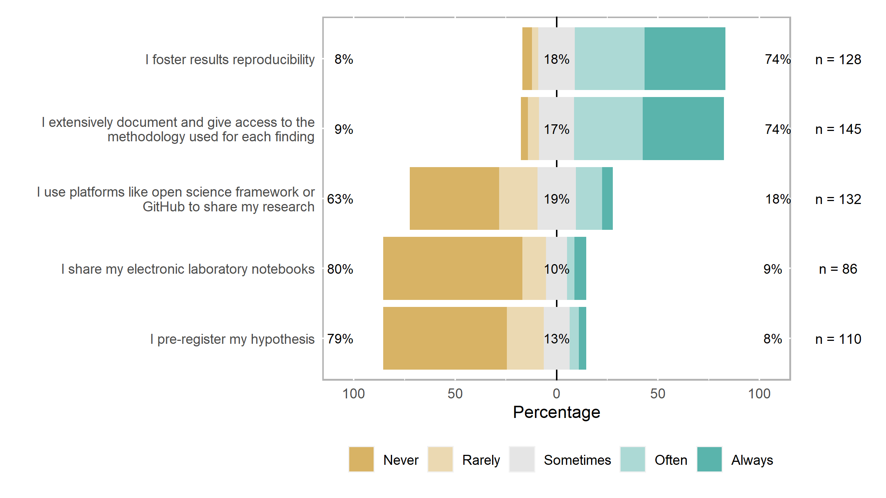<!-- -->


# A5 Practices regarding Open Peer Review

Please rate the following statements according to your practices regarding Open Peer Review.


```r
answer_levels <- c("Strongly disagree", "Disagree", "Neither agree nor disagree",
                   "Agree", "Strongly agree", 
                   "This topic is not relevant to my research", 
                   "Don’t know/ Don’t have enough information")


a5_df <- df %>% 
  select(starts_with("A5[")) 

a5_df_rec <- a5_df %>% 
  mutate(across(.fns = factor, levels = answer_levels))

a5_df_rec %>% 
  plot_likert()
```


|Variable                                                         |Strongly disagree |Disagree   |Neither agree nor disagree |Agree      |Strongly agree |
|:----------------------------------------------------------------|:-----------------|:----------|:--------------------------|:----------|:--------------|
|I opt for journals that offer the open peer review option        |18 (14.0%)        |38 (29.5%) |48 (37.2%)                 |17 (13.2%) |8 (6.2%)       |
|I sign my reviews                                                |36 (26.5%)        |39 (28.7%) |27 (19.9%)                 |26 (19.1%) |8 (5.9%)       |
|Open peer review improves the transparency of the review process |7 (4.9%)          |13 (9.2%)  |37 (26.1%)                 |47 (33.1%) |38 (26.8%)     |
|Platforms that allow open peer review are easy to use            |2 (2.2%)          |8 (8.7%)   |42 (45.7%)                 |28 (30.4%) |12 (13.0%)     |
|Reviewers’ comments are attentive in open peer-review            |6 (5.3%)          |4 (3.5%)   |55 (48.2%)                 |32 (28.1%) |17 (14.9%)     |


<!-- -->


# A6 Practices regarding Open Source Software

Please rate the following statements according to your practices regarding Open Source Software.


```r
a6_df <- df %>% 
  select(starts_with("A6[")) 

a6_df_rec <- a6_df %>% 
  mutate(across(.fns = factor, levels = answer_levels_2))

a6_df_rec %>% 
  plot_likert(legend_rows = 1)
```


|Variable                                                                          |Never      |Rarely     |Sometimes  |Often      |Always     |
|:---------------------------------------------------------------------------------|:----------|:----------|:----------|:----------|:----------|
|I develop software collaboratively                                                |11 (15.7%) |15 (21.4%) |15 (21.4%) |15 (21.4%) |14 (20.0%) |
|I extensively document my software development methodology                        |12 (16.0%) |13 (17.3%) |23 (30.7%) |15 (20.0%) |12 (16.0%) |
|I license my software to inform about the conditions under which it can be reused |28 (38.4%) |11 (15.1%) |10 (13.7%) |9 (12.3%)  |15 (20.5%) |
|I reuse and build upon open-source software                                       |14 (16.9%) |12 (14.5%) |23 (27.7%) |23 (27.7%) |11 (13.3%) |
|I share my software code (e.g. via GitHub, Figshare or Zenodo)                    |21 (25.9%) |14 (17.3%) |13 (16.0%) |21 (25.9%) |12 (14.8%) |


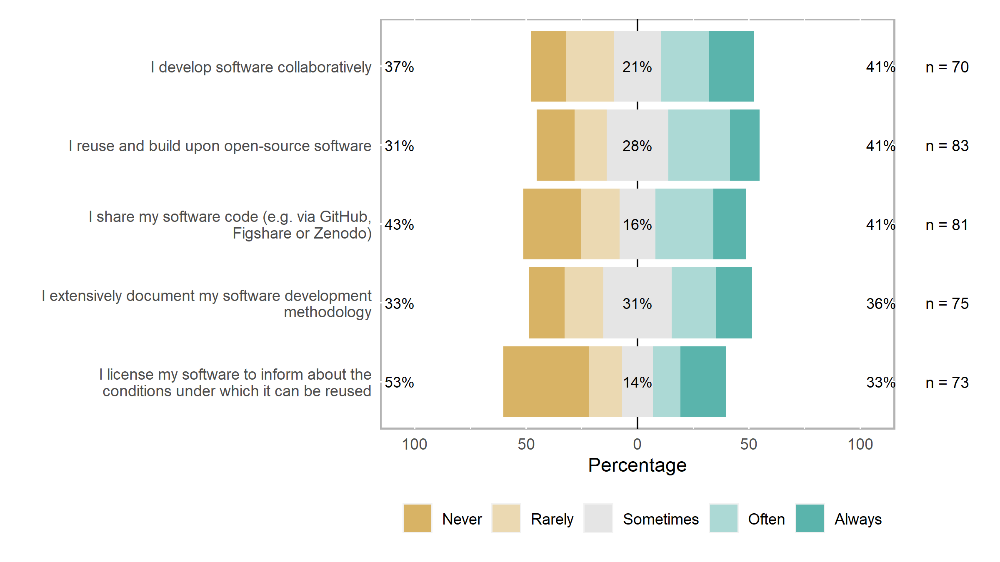<!-- -->


# A7 Practices regarding Licensing

Please rate the following statements according to your practices regarding Licensing.


```r
a7_df <- df %>% 
  select(starts_with("A7[")) 

a7_df_rec <- a7_df %>% 
  mutate(across(.fns = factor, levels = answer_levels))

a7_df_rec %>% 
  plot_likert()
```


|Variable                                                                                                        |Strongly disagree |Disagree   |Neither agree nor disagree |Agree      |Strongly agree |
|:---------------------------------------------------------------------------------------------------------------|:-----------------|:----------|:--------------------------|:----------|:--------------|
|I feel confident that when some scientific output is licensed, people using it will respect the licensing terms |5 (4.5%)          |12 (10.7%) |32 (28.6%)                 |43 (38.4%) |20 (17.9%)     |
|I license my publications                                                                                       |16 (15.5%)        |11 (10.7%) |26 (25.2%)                 |36 (35.0%) |14 (13.6%)     |
|I tend to use licenses that enable some kind of reuse                                                           |8 (7.5%)          |10 (9.4%)  |12 (11.3%)                 |55 (51.9%) |21 (19.8%)     |
|I use Creative Commons licenses                                                                                 |11 (9.8%)         |13 (11.6%) |17 (15.2%)                 |46 (41.1%) |25 (22.3%)     |
|Using a license will prevent unauthorised uses of my work                                                       |6 (5.3%)          |30 (26.3%) |31 (27.2%)                 |32 (28.1%) |15 (13.2%)     |


<!-- -->


# A8 Practices regarding Research Integrity

Please rate the following statements according to your practices regarding Research Integrity


```r
a8_df <- df %>% 
  select(starts_with("A8[")) 

a8_df_rec <- a8_df %>% 
  mutate(across(.fns = factor, levels = answer_levels_2))

a8_df_rec %>% 
  plot_likert(legend_rows = 1)
```


|Variable                                                                                               |Sometimes |Often      |Always      |Never    |Rarely   |
|:------------------------------------------------------------------------------------------------------|:---------|:----------|:-----------|:--------|:--------|
|I acknowledge all intellectual contributions and cite related work correctly in my publications        |1 (0.6%)  |12 (7.5%)  |147 (91.9%) |NA       |NA       |
|I comply with codes and regulations relevant to my discipline                                          |3 (2.0%)  |13 (8.6%)  |133 (88.1%) |1 (0.7%) |1 (0.7%) |
|I inform subjects and ask for their consent prior to disseminating my research                         |2 (1.9%)  |13 (12.6%) |84 (81.6%)  |2 (1.9%) |2 (1.9%) |
|I review publications without biases or influences                                                     |4 (2.6%)  |22 (14.4%) |123 (80.4%) |4 (2.6%) |NA       |
|I thoroughly inform my human subjects of all the details concerning their participation in my research |2 (2.1%)  |11 (11.6%) |81 (85.3%)  |NA       |1 (1.1%) |


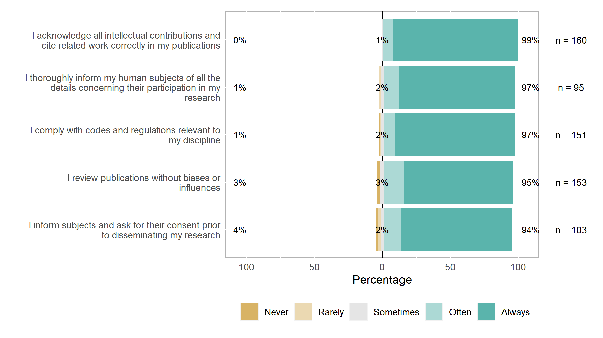<!-- -->


# A9 Practices regarding Citizen Science (information, consultation, public participation)

Please rate the following statements according to your practices regarding Citizen Science - consider all levels -information, consultation, public participation


```r
a9_df <- df %>% 
  select(starts_with("A9[")) 

a9_df_rec <- a9_df %>% 
  mutate(across(.fns = factor, levels = answer_levels))

a9_df_rec %>% 
  plot_likert()
```


|Variable                                                                      |Strongly disagree |Disagree   |Neither agree nor disagree |Agree      |Strongly agree |
|:-----------------------------------------------------------------------------|:-----------------|:----------|:--------------------------|:----------|:--------------|
|I align my research with challenges relevant for society                      |4 (2.6%)          |5 (3.2%)   |21 (13.6%)                 |52 (33.8%) |72 (46.8%)     |
|I ask for the citizen scientist’s feedback during the research process        |22 (19.1%)        |20 (17.4%) |24 (20.9%)                 |31 (27.0%) |18 (15.7%)     |
|I involve citizens in data gathering for my research                          |23 (20.2%)        |19 (16.7%) |23 (20.2%)                 |38 (33.3%) |11 (9.6%)      |
|I provide the public with the information they need to understand my research |4 (2.6%)          |4 (2.6%)   |28 (17.9%)                 |67 (42.9%) |53 (34.0%)     |
|I regularly publish news about my research                                    |12 (7.7%)         |29 (18.7%) |41 (26.5%)                 |47 (30.3%) |26 (16.8%)     |


<!-- -->


# A10 Practices regarding Gender Issues

Please rate the following statements according to your practices regarding Gender issues


```r
a10_df <- df %>% 
  select(starts_with("A10[")) 

a10_df_rec <- a10_df %>% 
  mutate(across(.fns = factor, levels = answer_levels))

a10_df_rec %>% 
  plot_likert()
```


|Variable                                                                                               |Strongly disagree |Disagree   |Neither agree nor disagree |Agree      |Strongly agree |
|:------------------------------------------------------------------------------------------------------|:-----------------|:----------|:--------------------------|:----------|:--------------|
|Gender equality is a concern in the constitution of my research team                                   |7 (5.1%)          |9 (6.5%)   |32 (23.2%)                 |46 (33.3%) |44 (31.9%)     |
|I conduct a gender-blind research                                                                      |8 (7.8%)          |14 (13.6%) |24 (23.3%)                 |32 (31.1%) |25 (24.3%)     |
|I guarantee that the groups involved in the project (e.g. samples, testing groups) are gender-balanced |8 (7.2%)          |13 (11.7%) |34 (30.6%)                 |34 (30.6%) |22 (19.8%)     |
|I look for gender equality when looking for project partners                                           |9 (6.3%)          |15 (10.5%) |37 (25.9%)                 |50 (35.0%) |32 (22.4%)     |
|I seek not to have imbalances in the decision-making process                                           |2 (1.4%)          |2 (1.4%)   |25 (17.0%)                 |73 (49.7%) |45 (30.6%)     |


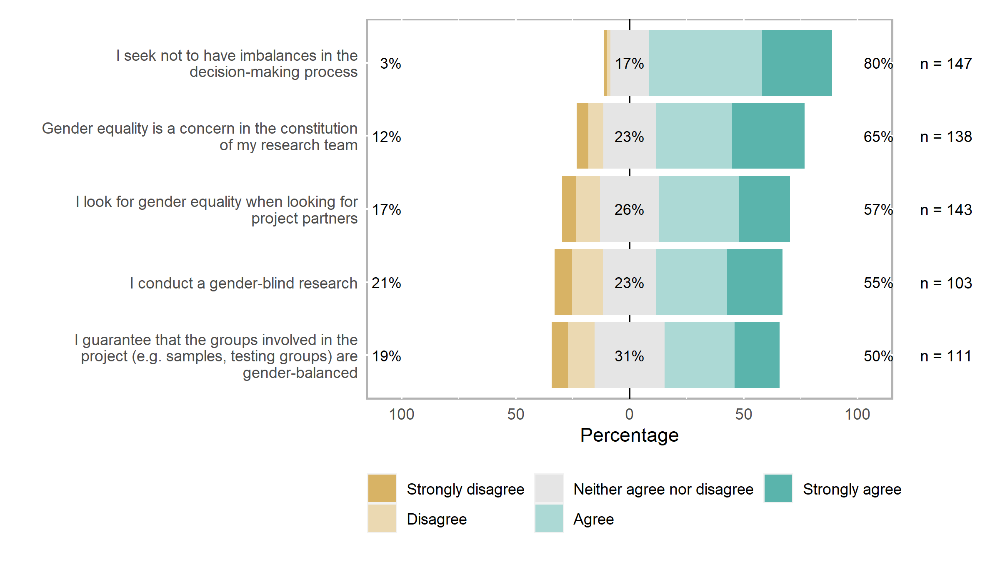<!-- -->

# Part B Training on OS topics

# B1 Attended Training Events

How many training events have you attended in these topics?


```r
answer_levels_b1 <- c("None", "1", "2", "3-5", "more than 5")


b1_df <- df %>% 
  select(starts_with("B1[")) 

b1_df_rec <- b1_df %>% 
  mutate(across(.fns = factor, levels = answer_levels_b1))


b1_df_rec %>% 
  plot_likert(center_for_likert = 1.5, legend_rows = 1)
```


|Variable              |None        |1          |2          |3-5        |
|:---------------------|:-----------|:----------|:----------|:----------|
|Citizen science       |141 (86.0%) |12 (7.3%)  |5 (3.0%)   |6 (3.7%)   |
|Gender                |105 (66.0%) |23 (14.5%) |17 (10.7%) |14 (8.8%)  |
|Licensing             |135 (82.3%) |23 (14.0%) |5 (3.0%)   |1 (0.6%)   |
|Open-Source Software  |137 (83.0%) |14 (8.5%)  |7 (4.2%)   |7 (4.2%)   |
|Open Access           |87 (54.0%)  |48 (29.8%) |17 (10.6%) |9 (5.6%)   |
|Open Data             |108 (66.3%) |37 (22.7%) |13 (8.0%)  |5 (3.1%)   |
|Open Peer Review      |139 (84.2%) |18 (10.9%) |3 (1.8%)   |5 (3.0%)   |
|Open Science          |121 (75.2%) |27 (16.8%) |9 (5.6%)   |4 (2.5%)   |
|Reproducible Research |125 (75.8%) |23 (13.9%) |8 (4.8%)   |9 (5.5%)   |
|Research integrity    |89 (55.6%)  |37 (23.1%) |16 (10.0%) |18 (11.2%) |


<!-- -->


# B3 Attended Different Types of Training Sessions

How often did you attend the following types of training sessions?


```r
answer_levels_b3 <- c("Never", "Once", "More than once")


b3_df <- df %>% 
  select(starts_with("B3[")) 

b3_df_rec <- b3_df %>% 
  mutate(across(.fns = factor, levels = answer_levels_b3))

b3_df_rec %>% 
  plot_likert(center_for_likert = 1.5, legend_rows = 1)
```


|Variable                          |Never       |Once       |More than once |
|:---------------------------------|:-----------|:----------|:--------------|
|Blended learning course           |145 (86.8%) |11 (6.6%)  |11 (6.6%)      |
|Full day workshop                 |101 (60.5%) |23 (13.8%) |43 (25.7%)     |
|Half day workshop                 |85 (50.9%)  |23 (13.8%) |59 (35.3%)     |
|MOOC (Massive Open Online Course) |131 (78.4%) |19 (11.4%) |17 (10.2%)     |
|Online course                     |100 (59.9%) |27 (16.2%) |40 (24.0%)     |
|Seminar                           |80 (47.9%)  |27 (16.2%) |60 (35.9%)     |
|Several days workshop             |127 (76.0%) |12 (7.2%)  |28 (16.8%)     |
|Summer/ Winter School             |142 (85.0%) |8 (4.8%)   |17 (10.2%)     |
|Webinar                           |73 (43.7%)  |22 (13.2%) |72 (43.1%)     |


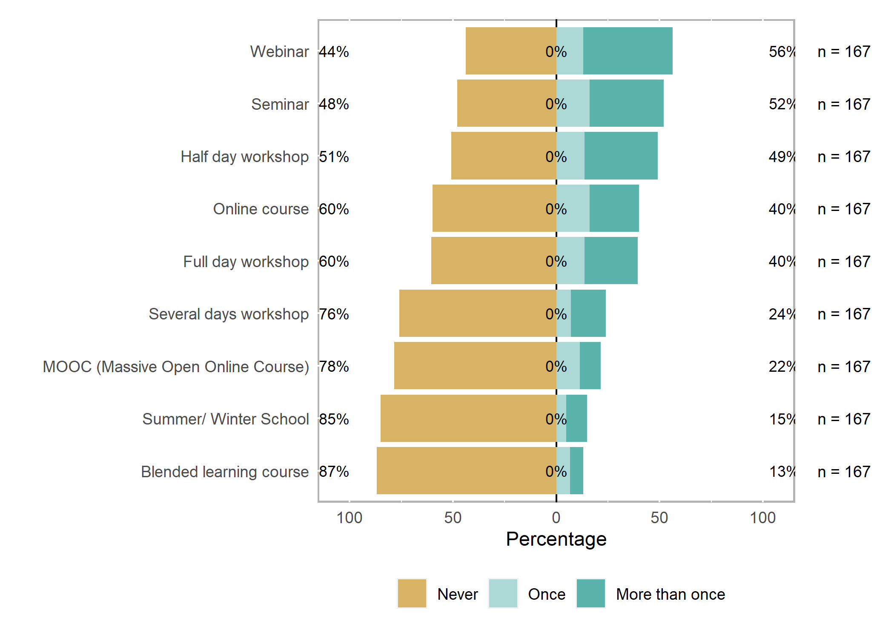<!-- -->


# B5 Hours of training

How many hours of training in total did you get?


```r
# answer_levels_b5 <- c("None", "1", "2", "3-5", "More than 5", "Other")
# # remove "none" category, since these people did not receive training at all
answer_levels_b5 <- c("1", "2", "3-5", "More than 5")

b5_df <- df %>% 
  select("B5")

b5_df_rec <- b5_df %>% 
  mutate(across(.fns = factor, levels = answer_levels_b5))

recode_successful(b5_df, b5_df_rec)
```

[1] "Component \"B5\": Mean absolute difference: 50"

```r
b5_df_rec %>% 
  plot_bar(B5, title = "Hours of training", reorder = FALSE, nudge_y = .065)
```

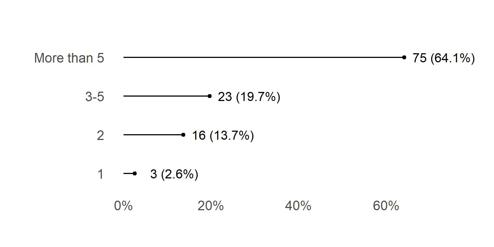<!-- -->


# B6 Attended Different Types of Training Sessions

Did the training you receive fulfill your needs?


```r
answer_levels_b6 <- c("I didn’t receive training", 
                      "I received adequate training", 
                      "I need more training")


b6_df <- df %>% 
  select(starts_with("B6[")) 

b6_df_rec <- b6_df %>% 
  mutate(across(.fns = factor, levels = answer_levels_b6))

b6_df_rec %>% 
  plot_likert(legend_rows = 1, centered = FALSE)
```


|Variable              |I didn’t receive training |I received adequate training |I need more training |
|:---------------------|:-------------------------|:----------------------------|:--------------------|
|Citizen science       |112 (72.3%)               |21 (13.5%)                   |22 (14.2%)           |
|Gender                |91 (56.2%)                |48 (29.6%)                   |23 (14.2%)           |
|Licensing             |103 (66.9%)               |20 (13.0%)                   |31 (20.1%)           |
|Open-Source Software  |105 (70.0%)               |18 (12.0%)                   |27 (18.0%)           |
|Open Access           |76 (46.3%)                |51 (31.1%)                   |37 (22.6%)           |
|Open Data             |90 (57.3%)                |32 (20.4%)                   |35 (22.3%)           |
|Open Peer Review      |116 (71.2%)               |21 (12.9%)                   |26 (16.0%)           |
|Open Science          |99 (61.1%)                |30 (18.5%)                   |33 (20.4%)           |
|Reproducible Research |100 (62.9%)               |37 (23.3%)                   |22 (13.8%)           |
|Research integrity    |88 (53.7%)                |60 (36.6%)                   |16 (9.8%)            |


<!-- -->


# B8 Attendance of first formal training in any Open Science topic

When did you attend your first formal training in any Open Science topic?


```r
answer_levels_b8 <- c("During doctoral studies", "As a researcher", "During a conference", "Other")

b8_df <- df %>% 
  select("B8")

b8_df_rec <- b8_df %>% 
  mutate(across(.fns = factor, levels = answer_levels_b8))

b8_df_rec %>% 
  filter(B8 != "Other") %>%
  plot_bar(B8, title = "Attendance of first formal training in any Open Science topic", reorder = FALSE, nudge_y = .15)
```

<!-- -->


Most responses from the "Other" category mention that they never received any
training.

# B9 Provider of attended training sessions

Who provided the training sessions you attended? (choose all that apply)


```r
answer_levels_3 <- c("No", "Yes")

b9_df <- df %>% 
  select(starts_with("B9[")) 

b9_df_rec <- b9_df %>% 
  mutate(across(.fns = factor, levels = answer_levels_3))

b9_df_rec %>% 
  plot_likert(legend_rows = 1)
```


|Variable                    |No          |Yes        |
|:---------------------------|:-----------|:----------|
|An external organisation    |135 (80.8%) |32 (19.2%) |
|Library                     |139 (83.2%) |28 (16.8%) |
|My institution              |74 (44.3%)  |93 (55.7%) |
|My professional association |144 (86.2%) |23 (13.8%) |
|My supervisor               |162 (97.0%) |5 (3.0%)   |
|Research school             |156 (93.4%) |11 (6.6%)  |
|Session at a conference     |137 (82.0%) |30 (18.0%) |


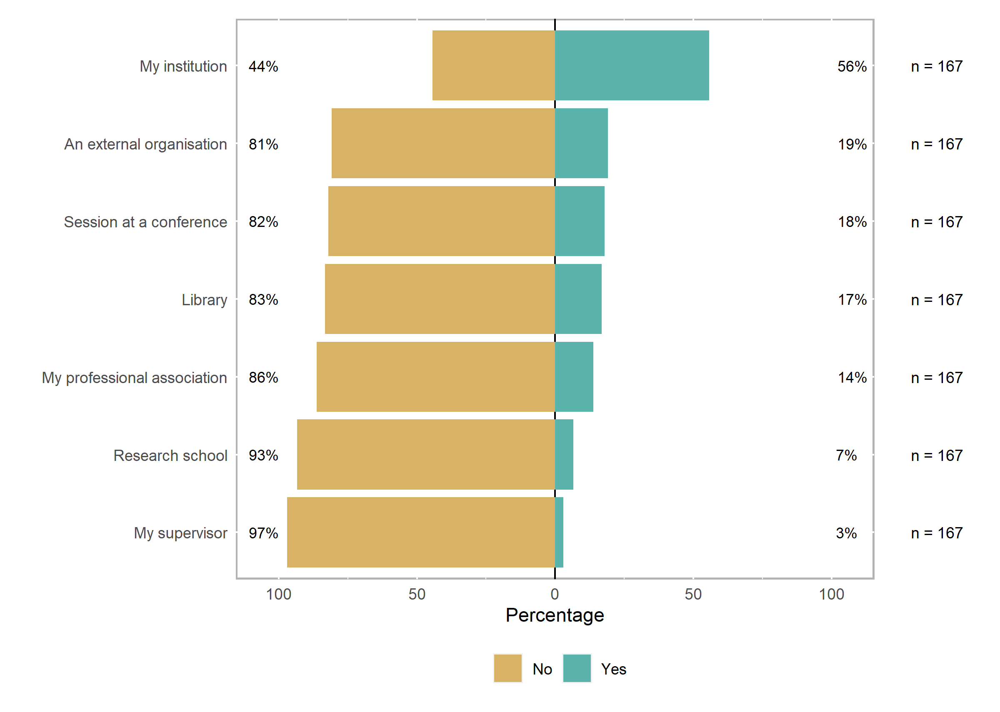<!-- -->


# B10 Preferred way to learn OS topics

What is your preferred way to learn open science topics? (choose all that apply)


```r
b10_df <- df %>% 
  select(starts_with("B10["))

b10_df_rec <- b10_df %>% 
  mutate(across(.fns = factor, levels = answer_levels_3))

b10_df_rec %>% 
  plot_likert(legend_rows = 1)
```


|Variable                                   |No          |Yes        |
|:------------------------------------------|:-----------|:----------|
|Discussions with peers                     |87 (52.1%)  |80 (47.9%) |
|I haven't learnt about Open Science topics |139 (83.2%) |28 (16.8%) |
|Mandatory training                         |145 (86.8%) |22 (13.2%) |
|Optional training                          |83 (49.7%)  |84 (50.3%) |
|Personal reading                           |105 (62.9%) |62 (37.1%) |


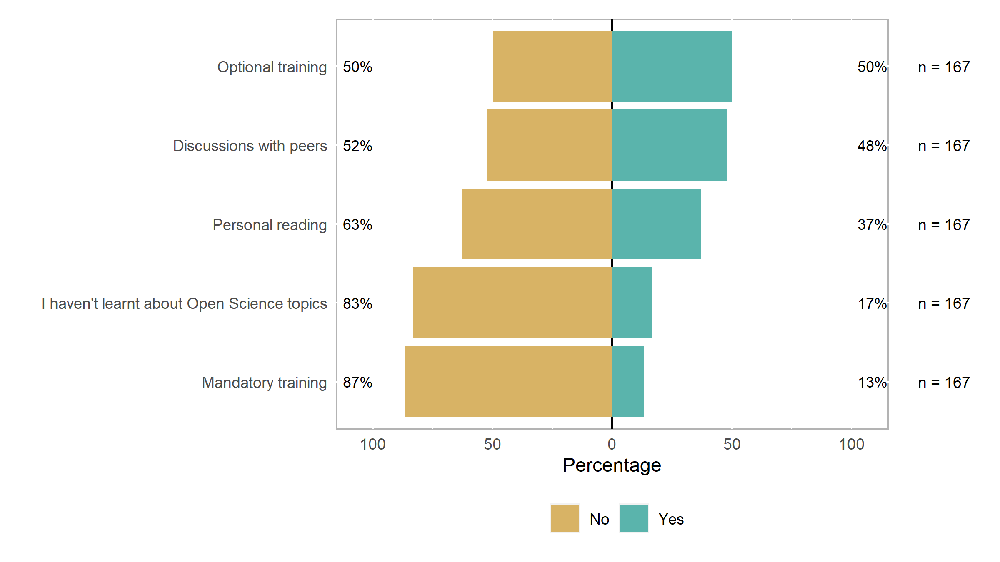<!-- -->


# B11 Has your awareness of open science practices increased after the training you attended?

Has your awareness of open science practices increased after the training you attended?


```r
answer_levels_4 <- c("Highly disagree", "Disagree",
                     "Neither agree nor disagree",
                     "Agree", "Highly agree")


b11_df <- df %>% 
  select(starts_with("B11[")) 

b11_df_rec <- b11_df %>% 
  mutate(across(.fns = factor, levels = answer_levels_4))

recode_successful(b11_df, b11_df_rec)
```

[1] "Component \"B11[SQ001]\": Mean absolute difference: 52"
[2] "Component \"B11[SQ002]\": Mean absolute difference: 46"
[3] "Component \"B11[SQ003]\": Mean absolute difference: 45"
[4] "Component \"B11[SQ004]\": Mean absolute difference: 45"

```r
b11_df_rec %>% 
  plot_likert()
```


|Variable                                                                |Highly disagree |Disagree   |Neither agree nor disagree |Agree      |Highly agree |
|:-----------------------------------------------------------------------|:---------------|:----------|:--------------------------|:----------|:------------|
|I am aware of the benefits, but I don’t really practice open science    |14 (11.5%)      |36 (29.5%) |36 (29.5%)                 |33 (27.0%) |3 (2.5%)     |
|I am more aware of the opportunities offered by practicing open science |5 (4.3%)        |7 (6.1%)   |30 (26.1%)                 |61 (53.0%) |12 (10.4%)   |
|I incorporated some open science practices in my daily research work    |4 (3.3%)        |8 (6.6%)   |32 (26.4%)                 |63 (52.1%) |14 (11.6%)   |
|I still don’t understand why I should make an extra effort              |32 (26.2%)      |48 (39.3%) |29 (23.8%)                 |10 (8.2%)  |3 (2.5%)     |


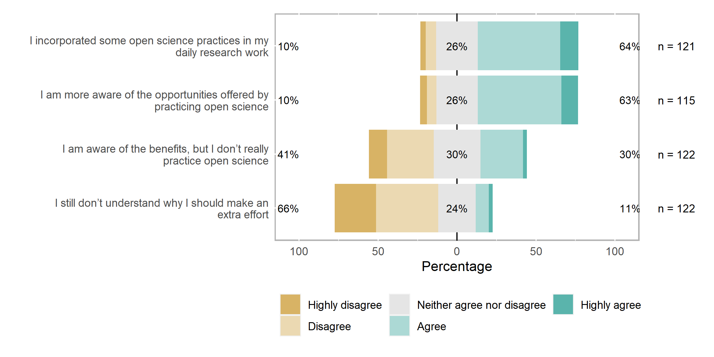<!-- -->


# B12 Share experience OS practices/tool with colleagues

Would you share your experience with open science practices and tools with colleagues?


```r
b12_df <- df %>% 
  select(starts_with("B12[")) 

b12_df_rec <- b12_df %>% 
  mutate(across(.fns = factor, levels = answer_levels_4))

b12_df_rec %>% 
  plot_likert()
```


|Variable                                                                                          |Highly disagree |Disagree   |Neither agree nor disagree |Agree      |Highly agree |
|:-------------------------------------------------------------------------------------------------|:---------------|:----------|:--------------------------|:----------|:------------|
|I would recommend my colleagues some of the practices I am using                                  |2 (1.5%)        |7 (5.1%)   |30 (22.1%)                 |73 (53.7%) |24 (17.6%)   |
|My colleagues wouldn’t make the effort                                                            |10 (8.1%)       |54 (43.9%) |38 (30.9%)                 |15 (12.2%) |6 (4.9%)     |
|My research community already has established open science practices                              |9 (7.0%)        |24 (18.6%) |35 (27.1%)                 |50 (38.8%) |11 (8.5%)    |
|My research community already has established tools and practices that don’t foresee open science |12 (10.0%)      |34 (28.3%) |43 (35.8%)                 |29 (24.2%) |2 (1.7%)     |


<!-- -->


# Further todos

- check out cases with weird first year of publication `df %>% filter(id %in% c(356, 420, 129))` 


