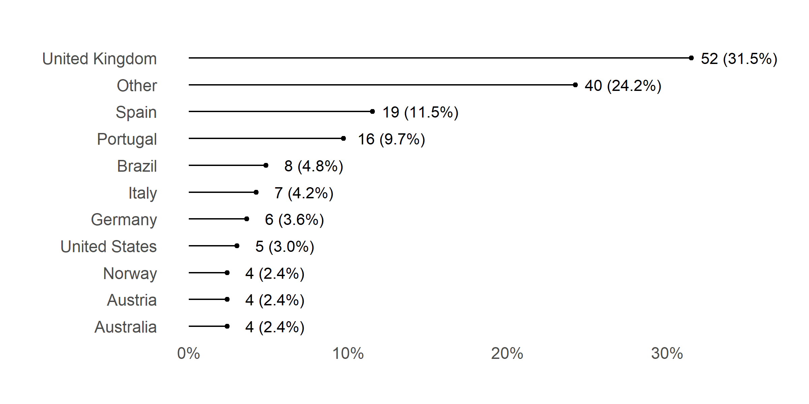
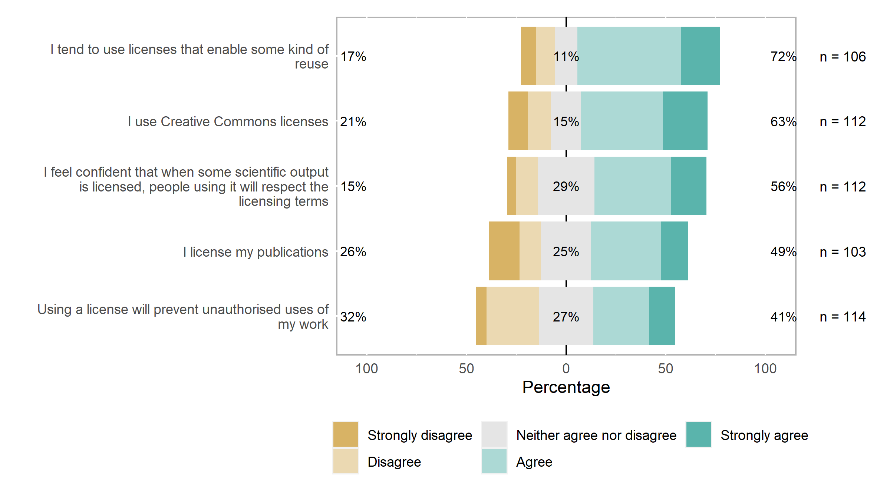
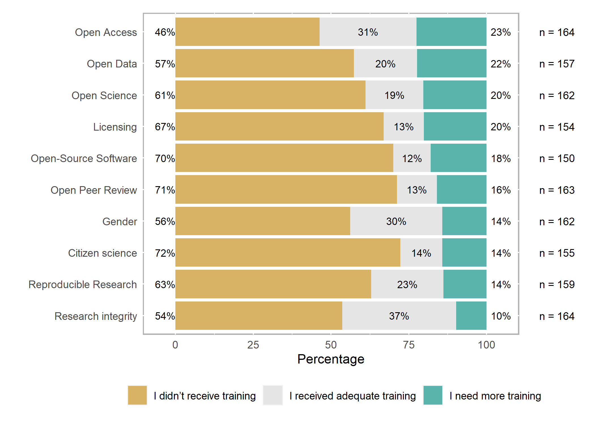
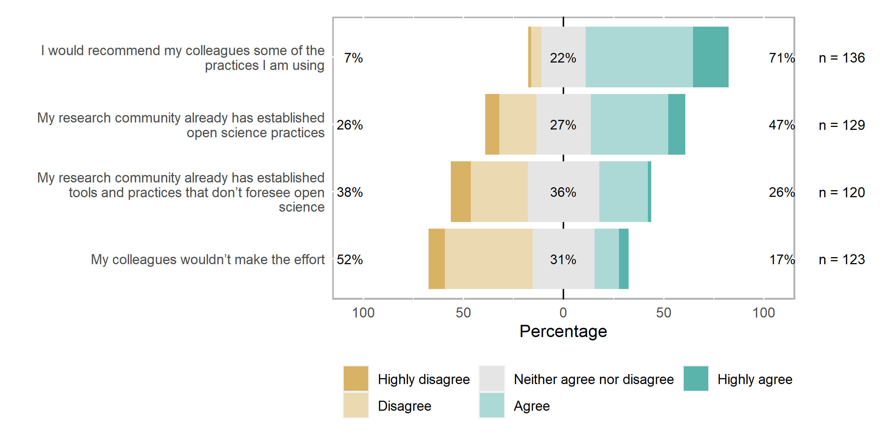

```r
# number of cases:
nrow(df)
```

```
## [1] 167
```
Our sample is based on 167 cases.

# Missing data


```r
library(visdat)
vis_dat(df)
```

<!-- -->

```r
visdat::vis_miss(df)
```

<!-- -->


```r
df %>% 
  select_if(function(x) (sum(is.na(x)))/length(x) > .1) %>% 
  vis_miss()
```

<!-- -->

# Demographics

# Countries

In which country do you work? [drop-down/ open text]


```r
e1_rec_df <- df %>%
  select("E1_rec")

e1_rec_df %>%
  mutate(E1_rec = forcats::fct_lump_min(E1_rec, min = 4, other_level = "Other")) %>%
  plot_bar(E1_rec, title = "Countries", reorder = TRUE, nudge_y = .03)
```

```
## Registered S3 methods overwritten by 'ggalt':
##   method                  from   
##   grid.draw.absoluteGrob  ggplot2
##   grobHeight.absoluteGrob ggplot2
##   grobWidth.absoluteGrob  ggplot2
##   grobX.absoluteGrob      ggplot2
##   grobY.absoluteGrob      ggplot2
```

<!-- -->


# Gender

Please select the gender category that best describes you


```r
answer_levels_e2 <- c("Man", "Woman", "Prefer not to say", "Other")

e2_df <- df %>% 
  select("E2")

e2_df_rec <- e2_df %>% 
  mutate(across(.fns = factor, levels = answer_levels_e2))


e2_df_rec %>% 
  plot_bar(E2, title = "Gender", reorder = TRUE, nudge_y = .079)
```

<!-- -->


# Age cohorts

What is your age?


```r
answer_levels_e3 <- c("<20", "20-29", "30-39", "40-49", "50-59", "60-69", "70+")

e3_df <- df %>% 
  select("E3")

e3_df_rec <- e3_df %>% 
  mutate(across(.fns = factor, levels = answer_levels_e3))


e3_df_rec %>% 
  summarise(across(.fns = ~sum(is.na(.x))))
```

```
## # A tibble: 1 x 1
##      E3
##   <int>
## 1     0
```

```r
e3_df_rec %>%
  mutate(across(.fns = as.numeric)) %>% 
  summarise(across(everything(), ~mean(.x, na.rm = TRUE)))
```

```
## # A tibble: 1 x 1
##      E3
##   <dbl>
## 1  4.49
```

```r
e3_df_rec %>%
  plot_bar(E3, title = "Age cohorts", reorder = FALSE, nudge_y = .028)
```

<!-- -->

# Publish first academic publication

When did you publish your first academic publication (journal article, book, chapter, conference proceeding, or similar)? Please tell us the year.


```r
e3b_df <- df %>% 
  select("E3b") %>% 
  filter(E3b > 1960)

e3b_df %>% 
  ggplot(aes(E3b)) +
  geom_histogram() +
  labs(x = NULL, y = NULL, title = NULL)
```

```
## `stat_bin()` using `bins = 30`. Pick better value with `binwidth`.
```

<!-- -->


# Highest education

What is the highest education level you completed? [drop down]


```r
answer_levels_e4 <- c("Post-secondary non-tertiary education (e.g. VET Schools, schools of healthcare and nursing)", "Short-cycle tertiary education (e.g. master schools, colleges, vocational training schools)", "Bachelor or equivalent", "Master or equivalent", "Doctorate or equivalent", "Other")

answer_labels_e4 <- str_wrap(answer_levels_e4, 30)

e4_df <- df %>% 
  select("E4")

e4_df_rec <- e4_df %>% 
  mutate(across(.fns = factor, levels = answer_levels_e4, 
                labels = answer_labels_e4))

e4_df_rec %>%
  plot_bar(E4, title = "Highest education", reorder = FALSE, nudge_y = .2)
```

<!-- -->

# Types of institution

In what type of institution do you work? [drop down]


```r
answer_levels_e5 <- c("University", "Public research institute", "Private research institute", "Company", "Nonprofit", "Other")

e5_df <- df %>% 
  select("E5")

e5_df_rec <- e5_df %>% 
  mutate(across(.fns = factor, levels = answer_levels_e5))

e5_df_rec %>% 
  plot_bar(E5, title = "Types of institution", reorder = TRUE, nudge_y = .13)
```

<!-- -->

# Position

What is your position? Choose all that apply


```r
answer_levels_e6 <- c("Junior Researcher", "Senior Researcher", "Ph.D. student", "Postdoctoral fellow/ researcher", "Assistant professor", 
                      "Associate professor", "Full professor", "Associate research scientist", "Instructor", "Lecturer", "Adjunct professor", 
                      "Technician or lab manager", "Core facility manager", "Other")

e6_df <- df %>% 
  select("E6")

e6_df_rec <- e6_df %>% 
  mutate(across(.fns = factor, levels = answer_levels_e6))

e6_df_rec %>% 
  plot_bar(E6, title = "Position", reorder = TRUE, nudge_y = .035)
```

<!-- -->

# Respondents by disciplines

In which general area of knowledge do you work?


```r
answer_levels_e7 <- c("Natural Sciences", "Engineering and technology", "Medical and health sciences", "Agricultural and Veterinary sciences", 
                      "Social Sciences", "Humanities and the Arts")

e7_df <- df %>% 
  select("E7")

e7_df_rec <- e7_df %>% 
  mutate(across(.fns = factor, levels = answer_levels_e7))

e7_df_rec %>% 
  plot_bar(E7, title = "Respondents by disciplines", reorder = TRUE, nudge_y = .055)
```

<!-- -->


# A1 Practices in OS

Please rate the following statements according to your practices regarding Open Science


```r
answer_levels <- c("Strongly disagree", "Disagree", "Neither agree nor disagree",
                   "Agree", "Strongly agree", 
                   "This topic is not relevant to my research", 
                   "Don’t know/ Don’t have enough information")


a1_df <- df %>% 
  select(starts_with("A1[")) 

a1_df_rec <- a1_df %>% 
  mutate(across(.fns = factor, levels = answer_levels))


recode_successful(a1_df, a1_df_rec)
```

[1] TRUE

```r
visdat::vis_miss(a1_df_rec)
```

<!-- -->

```r
a1_df_rec %>% 
  plot_likert()
```


|Variable                                                                               |Strongly disagree |Disagree |Neither agree nor disagree |Agree    |Strongly agree |
|:--------------------------------------------------------------------------------------|:-----------------|:--------|:--------------------------|:--------|:--------------|
|I make an effort to make my research collaborative                                     |4 (2%)            |2 (1%)   |14 (9%)                    |62 (38%) |81 (50%)       |
|I make an effort to make my research open                                              |3 (2%)            |3 (2%)   |14 (9%)                    |69 (43%) |73 (45%)       |
|Open science consists of different dimensions (e.g. publications, data, code, methods) |4 (3%)            |8 (5%)   |12 (8%)                    |74 (50%) |50 (34%)       |
|Open science is different from traditional research approaches                         |5 (3%)            |31 (20%) |38 (25%)                   |52 (34%) |26 (17%)       |
|Open science values transparency in research                                           |5 (3%)            |2 (1%)   |12 (8%)                    |46 (29%) |92 (59%)       |
<br><br><!-- -->


# A2 Own practices regarding Open Access publishing

Please rate the following statements according to your own practices regarding Open Access publishing.


```r
answer_levels_2 <- c("Never", "Rarely", "Sometimes",
                   "Often", "Always", "This topic is not relevant to my research", 
                   "Don’t know/ Don’t have enough information")


a2_df <- df %>% 
  select(starts_with("A2[")) 

a2_df_rec <- a2_df %>% 
  mutate(across(.fns = factor, levels = answer_levels_2))


a2_df %>% 
  summarise(across(.fns = ~sum(is.na(.x))))
```

# A tibble: 1 x 5
  `A2[SQ001]` `A2[SQ002]` `A2[SQ003]` `A2[SQ004]` `A2[SQ005]`
        <int>       <int>       <int>       <int>       <int>
1           3           2           5           7           7

```r
a2_df_rec %>% 
  plot_likert(legend_rows = 1)
```


|Variable                                                     |Never    |Rarely   |Sometimes |Often    |Always   |
|:------------------------------------------------------------|:--------|:--------|:---------|:--------|:--------|
|I deposit my preprints in a disciplinary preprint repository |30 (20%) |30 (20%) |32 (21%)  |22 (15%) |35 (23%) |
|I deposit my publications in a repository                    |2 (1%)   |10 (6%)  |20 (12%)  |43 (27%) |87 (54%) |
|I know how to get funding for open access publication fees   |21 (14%) |29 (20%) |38 (26%)  |36 (25%) |21 (14%) |
|I publish in open-access journals                            |8 (5%)   |22 (13%) |60 (37%)  |64 (39%) |9 (6%)   |
|I publish my publications under an open license              |7 (5%)   |21 (14%) |47 (32%)  |54 (36%) |20 (13%) |
<br><br><!-- -->


# A3 Own practices regarding Research Data Management

Please rate the following statements according to your own practices regarding Research Data Management.


```r
a3_df <- df %>% 
  select(starts_with("A3[")) 

a3_df_rec <- a3_df %>% 
  mutate(across(.fns = factor, levels = answer_levels_2))


a3_df %>% 
  summarise(across(.fns = ~sum(is.na(.x))))
```

# A tibble: 1 x 5
  `A3[SQ005]` `A3[SQ001]` `A3[SQ002]` `A3[SQ003]` `A3[SQ004]`
        <int>       <int>       <int>       <int>       <int>
1           4           5           7           7           8

```r
a3_df_rec %>% 
  plot_likert(legend_rows = 1)
```


|Variable                                                                         |Never    |Rarely   |Sometimes |Often    |Always   |
|:--------------------------------------------------------------------------------|:--------|:--------|:---------|:--------|:--------|
|I develop a data management plan                                                 |17 (12%) |30 (21%) |41 (29%)  |32 (22%) |23 (16%) |
|I publish my data under a license                                                |58 (49%) |23 (19%) |16 (14%)  |14 (12%) |7 (6%)   |
|I publish my data’s description along with its identifier (DOI, handle ,...)     |33 (24%) |21 (15%) |22 (16%)  |38 (27%) |25 (18%) |
|I share my data in a data repository                                             |35 (25%) |31 (22%) |28 (20%)  |28 (20%) |19 (13%) |
|When submitting an article, I make sure my data can be accessed by the reviewers |29 (21%) |26 (18%) |35 (25%)  |23 (16%) |28 (20%) |
<br><br><!-- -->


# A4 Practices regarding Reproducible Research

Please rate the following statements according to your practices regarding Reproducible Research


```r
a4_df <- df %>% 
  select(starts_with("A4[")) 

a4_df_rec <- a4_df %>% 
  mutate(across(.fns = factor, levels = answer_levels_2))


a4_df %>% 
  summarise(across(.fns = ~sum(is.na(.x))))
```

# A tibble: 1 x 5
  `A4[SQ001]` `A4[SQ002]` `A4[SQ003]` `A4[SQ004]` `A4[SQ005]`
        <int>       <int>       <int>       <int>       <int>
1           5           5           6          12           7

```r
a4_df_rec %>% 
  plot_likert(legend_rows = 1)
```


|Variable                                                                        |Never    |Rarely   |Sometimes |Often    |Always   |
|:-------------------------------------------------------------------------------|:--------|:--------|:---------|:--------|:--------|
|I extensively document and give access to the methodology used for each finding |5 (3%)   |8 (6%)   |25 (17%)  |49 (34%) |58 (40%) |
|I foster results reproducibility                                                |6 (5%)   |4 (3%)   |23 (18%)  |44 (34%) |51 (40%) |
|I pre-register my hypothesis                                                    |67 (61%) |20 (18%) |14 (13%)  |5 (5%)   |4 (4%)   |
|I share my electronic laboratory notebooks                                      |59 (69%) |10 (12%) |9 (10%)   |3 (3%)   |5 (6%)   |
|I use platforms like open science framework or GitHub to share my research      |58 (44%) |25 (19%) |25 (19%)  |17 (13%) |7 (5%)   |
<br><br><!-- -->


# A5 Practices regarding Open Peer Review

Please rate the following statements according to your practices regarding Open Peer Review.


```r
answer_levels <- c("Strongly disagree", "Disagree", "Neither agree nor disagree",
                   "Agree", "Strongly agree", 
                   "This topic is not relevant to my research", 
                   "Don’t know/ Don’t have enough information")


a5_df <- df %>% 
  select(starts_with("A5[")) 

a5_df_rec <- a5_df %>% 
  mutate(across(.fns = factor, levels = answer_levels))


a5_df %>% 
  summarise(across(.fns = ~sum(is.na(.x))))
```

# A tibble: 1 x 5
  `A5[SQ001]` `A5[SQ002]` `A5[SQ003]` `A5[SQ004]` `A5[SQ005]`
        <int>       <int>       <int>       <int>       <int>
1           6          10          10          10          12

```r
a5_df_rec %>% 
  plot_likert()
```


|Variable                                                         |Strongly disagree |Disagree |Neither agree nor disagree |Agree    |Strongly agree |
|:----------------------------------------------------------------|:-----------------|:--------|:--------------------------|:--------|:--------------|
|I opt for journals that offer the open peer review option        |18 (14%)          |38 (29%) |48 (37%)                   |17 (13%) |8 (6%)         |
|I sign my reviews                                                |36 (26%)          |39 (29%) |27 (20%)                   |26 (19%) |8 (6%)         |
|Open peer review improves the transparency of the review process |7 (5%)            |13 (9%)  |37 (26%)                   |47 (33%) |38 (27%)       |
|Platforms that allow open peer review are easy to use            |2 (2%)            |8 (9%)   |42 (46%)                   |28 (30%) |12 (13%)       |
|Reviewers’ comments are attentive in open peer-review            |6 (5%)            |4 (4%)   |55 (48%)                   |32 (28%) |17 (15%)       |
<br><br><!-- -->


# A6 Practices regarding Open Source Software

Please rate the following statements according to your practices regarding Open Source Software.


```r
a6_df <- df %>% 
  select(starts_with("A6[")) 

a6_df_rec <- a6_df %>% 
  mutate(across(.fns = factor, levels = answer_levels_2))


a6_df %>% 
  summarise(across(.fns = ~sum(is.na(.x))))
```

# A tibble: 1 x 5
  `A6[SQ001]` `A6[SQ002]` `A6[SQ003]` `A6[SQ004]` `A6[SQ005]`
        <int>       <int>       <int>       <int>       <int>
1           9           8           9           9           9

```r
a6_df_rec %>% 
  plot_likert(legend_rows = 1)
```


|Variable                                                                          |Never    |Rarely   |Sometimes |Often    |Always   |
|:---------------------------------------------------------------------------------|:--------|:--------|:---------|:--------|:--------|
|I develop software collaboratively                                                |11 (16%) |15 (21%) |15 (21%)  |15 (21%) |14 (20%) |
|I extensively document my software development methodology                        |12 (16%) |13 (17%) |23 (31%)  |15 (20%) |12 (16%) |
|I license my software to inform about the conditions under which it can be reused |28 (38%) |11 (15%) |10 (14%)  |9 (12%)  |15 (21%) |
|I reuse and build upon open-source software                                       |14 (17%) |12 (14%) |23 (28%)  |23 (28%) |11 (13%) |
|I share my software code (e.g. via GitHub, Figshare or Zenodo)                    |21 (26%) |14 (17%) |13 (16%)  |21 (26%) |12 (15%) |
<br><br><!-- -->


# A7 Practices regarding Licensing

Please rate the following statements according to your practices regarding Licensing.


```r
a7_df <- df %>% 
  select(starts_with("A7[")) 

a7_df_rec <- a7_df %>% 
  mutate(across(.fns = factor, levels = answer_levels))


a7_df %>% 
  summarise(across(.fns = ~sum(is.na(.x))))
```

# A tibble: 1 x 5
  `A7[SQ001]` `A7[SQ002]` `A7[SQ003]` `A7[SQ004]` `A7[SQ005]`
        <int>       <int>       <int>       <int>       <int>
1          11          13          14          11           9

```r
a7_df_rec %>% 
  plot_likert()
```


|Variable                                                                                                        |Strongly disagree |Disagree |Neither agree nor disagree |Agree    |Strongly agree |
|:---------------------------------------------------------------------------------------------------------------|:-----------------|:--------|:--------------------------|:--------|:--------------|
|I feel confident that when some scientific output is licensed, people using it will respect the licensing terms |5 (4%)            |12 (11%) |32 (29%)                   |43 (38%) |20 (18%)       |
|I license my publications                                                                                       |16 (16%)          |11 (11%) |26 (25%)                   |36 (35%) |14 (14%)       |
|I tend to use licenses that enable some kind of reuse                                                           |8 (8%)            |10 (9%)  |12 (11%)                   |55 (52%) |21 (20%)       |
|I use Creative Commons licenses                                                                                 |11 (10%)          |13 (12%) |17 (15%)                   |46 (41%) |25 (22%)       |
|Using a license will prevent unauthorised uses of my work                                                       |6 (5%)            |30 (26%) |31 (27%)                   |32 (28%) |15 (13%)       |
<br><br><!-- -->


# A8 Practices regarding Research Integrity

Please rate the following statements according to your practices regarding Research Integrity


```r
a8_df <- df %>% 
  select(starts_with("A8[")) 

a8_df_rec <- a8_df %>% 
  mutate(across(.fns = factor, levels = answer_levels_2))


a8_df %>% 
  summarise(across(.fns = ~sum(is.na(.x))))
```

# A tibble: 1 x 5
  `A8[SQ001]` `A8[SQ002]` `A8[SQ003]` `A8[SQ004]` `A8[SQ005]`
        <int>       <int>       <int>       <int>       <int>
1           5           5           5           5           7

```r
a8_df_rec %>% 
  plot_likert(legend_rows = 1)
```


|Variable                                                                                               |Sometimes |Often    |Always    |Never  |Rarely |
|:------------------------------------------------------------------------------------------------------|:---------|:--------|:---------|:------|:------|
|I acknowledge all intellectual contributions and cite related work correctly in my publications        |1 (1%)    |12 (8%)  |147 (92%) |NA     |NA     |
|I comply with codes and regulations relevant to my discipline                                          |3 (2%)    |13 (9%)  |133 (88%) |1 (1%) |1 (1%) |
|I inform subjects and ask for their consent prior to disseminating my research                         |2 (2%)    |13 (13%) |84 (82%)  |2 (2%) |2 (2%) |
|I review publications without biases or influences                                                     |4 (3%)    |22 (14%) |123 (80%) |4 (3%) |NA     |
|I thoroughly inform my human subjects of all the details concerning their participation in my research |2 (2%)    |11 (12%) |81 (85%)  |NA     |1 (1%) |
<br><br><!-- -->


# A9 Practices regarding Citizen Science (information, consultation, public participation)

Please rate the following statements according to your practices regarding Citizen Science - consider all levels -information, consultation, public participation


```r
a9_df <- df %>% 
  select(starts_with("A9[")) 

a9_df_rec <- a9_df %>% 
  mutate(across(.fns = factor, levels = answer_levels))


a9_df %>% 
  summarise(across(.fns = ~sum(is.na(.x))))
```

# A tibble: 1 x 5
  `A9[SQ001]` `A9[SQ002]` `A9[SQ003]` `A9[SQ004]` `A9[SQ005]`
        <int>       <int>       <int>       <int>       <int>
1           5           5           4           5           6

```r
a9_df_rec %>% 
  plot_likert()
```


|Variable                                                                      |Strongly disagree |Disagree |Neither agree nor disagree |Agree    |Strongly agree |
|:-----------------------------------------------------------------------------|:-----------------|:--------|:--------------------------|:--------|:--------------|
|I align my research with challenges relevant for society                      |4 (3%)            |5 (3%)   |21 (14%)                   |52 (34%) |72 (47%)       |
|I ask for the citizen scientist’s feedback during the research process        |22 (19%)          |20 (17%) |24 (21%)                   |31 (27%) |18 (16%)       |
|I involve citizens in data gathering for my research                          |23 (20%)          |19 (17%) |23 (20%)                   |38 (33%) |11 (10%)       |
|I provide the public with the information they need to understand my research |4 (3%)            |4 (3%)   |28 (18%)                   |67 (43%) |53 (34%)       |
|I regularly publish news about my research                                    |12 (8%)           |29 (19%) |41 (26%)                   |47 (30%) |26 (17%)       |
<br><br><!-- -->


# A10 Practices regarding Gender Issues

Please rate the following statements according to your practices regarding Gender issues


```r
a10_df <- df %>% 
  select(starts_with("A10[")) 

a10_df_rec <- a10_df %>% 
  mutate(across(.fns = factor, levels = answer_levels))


a10_df %>% 
  summarise(across(.fns = ~sum(is.na(.x))))
```

# A tibble: 1 x 5
  `A10[SQ001]` `A10[SQ002]` `A10[SQ003]` `A10[SQ004]` `A10[SQ005]`
         <int>        <int>        <int>        <int>        <int>
1            4            4            5            6            7

```r
a10_df_rec %>% 
  plot_likert()
```


|Variable                                                                                               |Strongly disagree |Disagree |Neither agree nor disagree |Agree    |Strongly agree |
|:------------------------------------------------------------------------------------------------------|:-----------------|:--------|:--------------------------|:--------|:--------------|
|Gender equality is a concern in the constitution of my research team                                   |7 (5%)            |9 (7%)   |32 (23%)                   |46 (33%) |44 (32%)       |
|I conduct a gender-blind research                                                                      |8 (8%)            |14 (14%) |24 (23%)                   |32 (31%) |25 (24%)       |
|I guarantee that the groups involved in the project (e.g. samples, testing groups) are gender-balanced |8 (7%)            |13 (12%) |34 (31%)                   |34 (31%) |22 (20%)       |
|I look for gender equality when looking for project partners                                           |9 (6%)            |15 (10%) |37 (26%)                   |50 (35%) |32 (22%)       |
|I seek not to have imbalances in the decision-making process                                           |2 (1%)            |2 (1%)   |25 (17%)                   |73 (50%) |45 (31%)       |
<br><br><!-- -->

# Part B Training on OS topics

# B1 Attended Training Events

How many training events have you attended in these topics?


```r
answer_levels_b1 <- c("None", "1", "2", "3-5", "more than 5")


b1_df <- df %>% 
  select(starts_with("B1[")) 

b1_df_rec <- b1_df %>% 
  mutate(across(.fns = factor, levels = answer_levels_b1))


b1_df %>% 
  summarise(across(.fns = ~sum(is.na(.x))))
```

# A tibble: 1 x 11
  `B1[SQ001]` `B1[SQ002]` `B1[SQ003]` `B1[SQ004]` `B1[SQ005]` `B1[SQ006]`
        <int>       <int>       <int>       <int>       <int>       <int>
1           0           0           0           0           0           0
# ... with 5 more variables: B1[SQ007] <int>, B1[SQ008] <int>, B1[SQ009] <int>,
#   B1[SQ010] <int>, B1[SQ013] <int>

```r
b1_df_rec %>% 
  plot_likert(center_for_likert = 1.5, legend_rows = 1)
```


|Variable              |None      |1        |2        |3-5      |
|:---------------------|:---------|:--------|:--------|:--------|
|Citizen science       |141 (86%) |12 (7%)  |5 (3%)   |6 (4%)   |
|Gender                |105 (66%) |23 (14%) |17 (11%) |14 (9%)  |
|Licensing             |135 (82%) |23 (14%) |5 (3%)   |1 (1%)   |
|Open-Source Software  |137 (83%) |14 (8%)  |7 (4%)   |7 (4%)   |
|Open Access           |87 (54%)  |48 (30%) |17 (11%) |9 (6%)   |
|Open Data             |108 (66%) |37 (23%) |13 (8%)  |5 (3%)   |
|Open Peer Review      |139 (84%) |18 (11%) |3 (2%)   |5 (3%)   |
|Open Science          |121 (75%) |27 (17%) |9 (6%)   |4 (2%)   |
|Reproducible Research |125 (76%) |23 (14%) |8 (5%)   |9 (5%)   |
|Research integrity    |89 (56%)  |37 (23%) |16 (10%) |18 (11%) |
<br><br><!-- -->


# B3 Attended Different Types of Training Sessions

How often did you attend the following types of training sessions?


```r
answer_levels_b3 <- c("Never", "Once", "More than once")


b3_df <- df %>% 
  select(starts_with("B3[")) 

b3_df_rec <- b3_df %>% 
  mutate(across(.fns = factor, levels = answer_levels_b3))


b3_df_rec %>% 
  summarise(across(.fns = ~sum(is.na(.x))))
```

# A tibble: 1 x 10
  `B3[SQ001]` `B3[SQ002]` `B3[SQ003]` `B3[SQ004]` `B3[SQ005]` `B3[SQ006]`
        <int>       <int>       <int>       <int>       <int>       <int>
1           0           0           0           0           0           0
# ... with 4 more variables: B3[SQ007] <int>, B3[SQ008] <int>, B3[SQ009] <int>,
#   B3[SQ013] <int>

```r
b3_df_rec %>% 
  plot_likert(center_for_likert = 1.5, legend_rows = 1)
```


|Variable                          |Never     |Once     |More than once |
|:---------------------------------|:---------|:--------|:--------------|
|Blended learning course           |145 (87%) |11 (7%)  |11 (7%)        |
|Full day workshop                 |101 (60%) |23 (14%) |43 (26%)       |
|Half day workshop                 |85 (51%)  |23 (14%) |59 (35%)       |
|MOOC (Massive Open Online Course) |131 (78%) |19 (11%) |17 (10%)       |
|Online course                     |100 (60%) |27 (16%) |40 (24%)       |
|Seminar                           |80 (48%)  |27 (16%) |60 (36%)       |
|Several days workshop             |127 (76%) |12 (7%)  |28 (17%)       |
|Summer/ Winter School             |142 (85%) |8 (5%)   |17 (10%)       |
|Webinar                           |73 (44%)  |22 (13%) |72 (43%)       |
<br><br><!-- -->


# B5 Hours of training

How many hours of training in total did you get?


```r
# answer_levels_b5 <- c("None", "1", "2", "3-5", "More than 5", "Other")
# # remove "none" category, since these people did not receive training at all
answer_levels_b5 <- c("1", "2", "3-5", "More than 5")

b5_df <- df %>% 
  select("B5")

b5_df_rec <- b5_df %>% 
  mutate(across(.fns = factor, levels = answer_levels_b5))

recode_successful(b5_df, b5_df_rec)
```

[1] "Component \"B5\": Mean absolute difference: 50"

```r
b5_df_rec %>% 
  plot_bar(B5, title = "Hours of training", reorder = FALSE, nudge_y = .065)
```

<!-- -->


# B6 Attended Different Types of Training Sessions

Did the training you receive fulfill your needs?


```r
answer_levels_b6 <- c("I didn’t receive training", 
                      "I received adequate training", 
                      "I need more training")


b6_df <- df %>% 
  select(starts_with("B6[")) 

b6_df_rec <- b6_df %>% 
  mutate(across(.fns = factor, levels = answer_levels_b6))


b6_df_rec %>% 
  summarise(across(.fns = ~sum(is.na(.x))))
```

# A tibble: 1 x 11
  `B6[SQ001]` `B6[SQ002]` `B6[SQ003]` `B6[SQ004]` `B6[SQ005]` `B6[SQ006]`
        <int>       <int>       <int>       <int>       <int>       <int>
1           5           3          10           8           4          17
# ... with 5 more variables: B6[SQ007] <int>, B6[SQ008] <int>, B6[SQ009] <int>,
#   B6[SQ010] <int>, B6[SQ013] <int>

```r
b6_df_rec %>% 
  plot_likert(legend_rows = 1, centered = FALSE)
```


|Variable              |I didn’t receive training |I received adequate training |I need more training |
|:---------------------|:-------------------------|:----------------------------|:--------------------|
|Citizen science       |112 (72%)                 |21 (14%)                     |22 (14%)             |
|Gender                |91 (56%)                  |48 (30%)                     |23 (14%)             |
|Licensing             |103 (67%)                 |20 (13%)                     |31 (20%)             |
|Open-Source Software  |105 (70%)                 |18 (12%)                     |27 (18%)             |
|Open Access           |76 (46%)                  |51 (31%)                     |37 (23%)             |
|Open Data             |90 (57%)                  |32 (20%)                     |35 (22%)             |
|Open Peer Review      |116 (71%)                 |21 (13%)                     |26 (16%)             |
|Open Science          |99 (61%)                  |30 (19%)                     |33 (20%)             |
|Reproducible Research |100 (63%)                 |37 (23%)                     |22 (14%)             |
|Research integrity    |88 (54%)                  |60 (37%)                     |16 (10%)             |
<br><br><!-- -->


# B8 Attendance of first formal training in any Open Science topic

When did you attend your first formal training in any Open Science topic?


```r
answer_levels_b8 <- c("During doctoral studies", "As a researcher", "During a conference", "Other")

b8_df <- df %>% 
  select("B8")

b8_df_rec <- b8_df %>% 
  mutate(across(.fns = factor, levels = answer_levels_b8))


b8_df_rec %>% 
  filter(B8 != "Other") %>%
  plot_bar(B8, title = "Attendance of first formal training in any Open Science topic", reorder = FALSE, nudge_y = .12)
```

<!-- -->


Most responses from the "Other" category mention that they never received any
training.

# B9 Provider of attended training sessions

Who provided the training sessions you attended? (choose all that apply)


```r
answer_levels_3 <- c("Yes", "No")

b9_df <- df %>% 
  select(starts_with("B9[")) 

b9_df_rec <- b9_df %>% 
  mutate(across(.fns = factor, levels = answer_levels_3))


b9_df_rec %>% 
  plot_likert(legend_rows = 1)
```


|Variable                    |Yes      |No        |
|:---------------------------|:--------|:---------|
|An external organisation    |32 (19%) |135 (81%) |
|Library                     |28 (17%) |139 (83%) |
|My institution              |93 (56%) |74 (44%)  |
|My professional association |23 (14%) |144 (86%) |
|My supervisor               |5 (3%)   |162 (97%) |
|Research school             |11 (7%)  |156 (93%) |
|Session at a conference     |30 (18%) |137 (82%) |
<br><br><!-- -->


# B10 Preferred way to learn OS topics

What is your preferred way to learn open science topics? (choose all that apply)


```r
b10_df <- df %>% 
  select(starts_with("B10["))

b10_df_rec <- b10_df %>% 
  mutate(across(.fns = factor, levels = answer_levels_3))


b10_df_rec %>% 
  plot_likert(legend_rows = 1)
```


|Variable                                   |Yes      |No        |
|:------------------------------------------|:--------|:---------|
|Discussions with peers                     |80 (48%) |87 (52%)  |
|I haven't learnt about Open Science topics |28 (17%) |139 (83%) |
|Mandatory training                         |22 (13%) |145 (87%) |
|Optional training                          |84 (50%) |83 (50%)  |
|Personal reading                           |62 (37%) |105 (63%) |
<br><br><!-- -->


# B11 Has your awareness of open science practices increased after the training you attended?

Has your awareness of open science practices increased after the training you attended?


```r
answer_levels_4 <- c("Highly disagree", "Disagree",
                     "Neither agree nor disagree",
                     "Agree", "Highly agree")


b11_df <- df %>% 
  select(starts_with("B11[")) 

b11_df_rec <- b11_df %>% 
  mutate(across(.fns = factor, levels = answer_levels_4))

recode_successful(b11_df, b11_df_rec)
```

[1] "Component \"B11[SQ001]\": Mean absolute difference: 52"
[2] "Component \"B11[SQ002]\": Mean absolute difference: 46"
[3] "Component \"B11[SQ003]\": Mean absolute difference: 45"
[4] "Component \"B11[SQ004]\": Mean absolute difference: 45"

```r
b11_df_rec %>% 
  plot_likert()
```


|Variable                                                                |Highly disagree |Disagree |Neither agree nor disagree |Agree    |Highly agree |
|:-----------------------------------------------------------------------|:---------------|:--------|:--------------------------|:--------|:------------|
|I am aware of the benefits, but I don’t really practice open science    |14 (11%)        |36 (30%) |36 (30%)                   |33 (27%) |3 (2%)       |
|I am more aware of the opportunities offered by practicing open science |5 (4%)          |7 (6%)   |30 (26%)                   |61 (53%) |12 (10%)     |
|I incorporated some open science practices in my daily research work    |4 (3%)          |8 (7%)   |32 (26%)                   |63 (52%) |14 (12%)     |
|I still don’t understand why I should make an extra effort              |32 (26%)        |48 (39%) |29 (24%)                   |10 (8%)  |3 (2%)       |
<br><br><!-- -->


# B12 Share experience OS practices/tool with colleagues

Would you share your experience with open science practices and tools with colleagues?


```r
b12_df <- df %>% 
  select(starts_with("B12[")) 

b12_df_rec <- b12_df %>% 
  mutate(across(.fns = factor, levels = answer_levels_4))


b12_df_rec %>% 
  summarise(across(.fns = ~sum(is.na(.x))))
```

# A tibble: 1 x 4
  `B12[SQ001]` `B12[SQ002]` `B12[SQ003]` `B12[SQ004]`
         <int>        <int>        <int>        <int>
1           31           38           47           44

```r
b12_df_rec %>% 
  plot_likert()
```


|Variable                                                                                          |Highly disagree |Disagree |Neither agree nor disagree |Agree    |Highly agree |
|:-------------------------------------------------------------------------------------------------|:---------------|:--------|:--------------------------|:--------|:------------|
|I would recommend my colleagues some of the practices I am using                                  |2 (1%)          |7 (5%)   |30 (22%)                   |73 (54%) |24 (18%)     |
|My colleagues wouldn’t make the effort                                                            |10 (8%)         |54 (44%) |38 (31%)                   |15 (12%) |6 (5%)       |
|My research community already has established open science practices                              |9 (7%)          |24 (19%) |35 (27%)                   |50 (39%) |11 (9%)      |
|My research community already has established tools and practices that don’t foresee open science |12 (10%)        |34 (28%) |43 (36%)                   |29 (24%) |2 (2%)       |
<br><br><!-- -->


# Further todos

- check out cases with weird first year of publication `df %>% filter(id %in% c(356, 420, 129))` 


