```r
# exploring missing data

vis_dat(df)
```

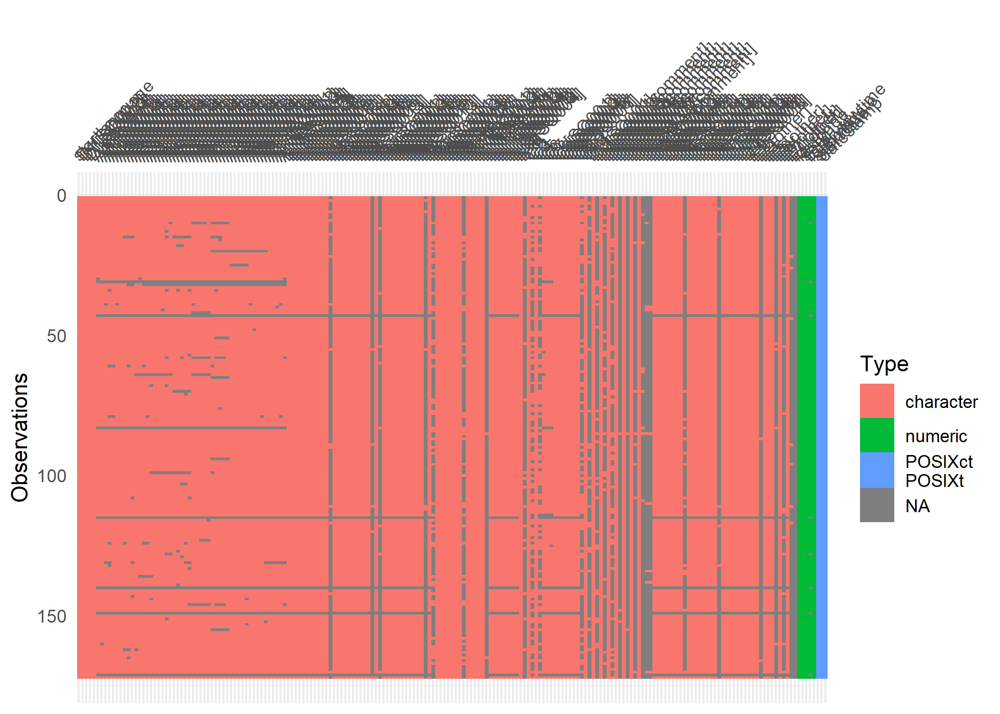<!-- -->

```r
visdat::vis_miss(df)
```

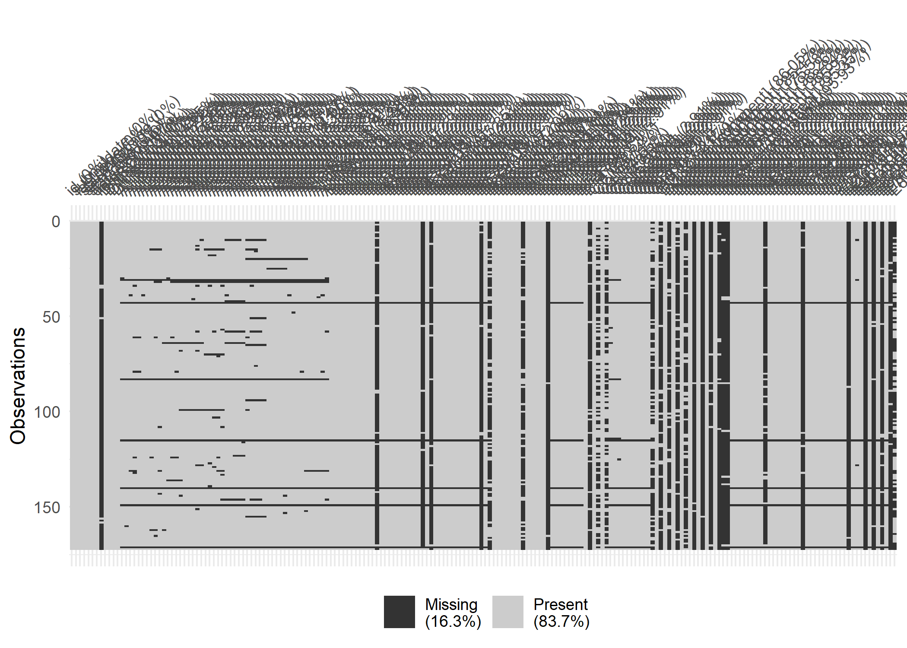<!-- -->

```r
df %>% 
  select_if(function(x) (sum(is.na(x)))/length(x) > .1) %>% 
  vis_miss()
```

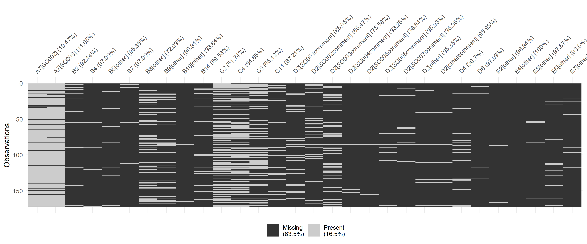<!-- -->


```r
#exploring pratices in OS

answer_levels <- c("Strongly disagree", "Disagree", "Neither agree nor disagree",
                   "Agree", "Strongly agree", 
                   "This topic is not relevant to my research", 
                   "Don’t know/ Don’t have enough information")


a1_df <- df %>% 
  select(starts_with("A1[")) 

a1_df_rec <- a1_df %>% 
  mutate(across(.fns = factor, levels = answer_levels))


a1_df %>% 
  summarise(across(.fns = ~sum(is.na(.x))))
```

```
## # A tibble: 1 x 5
##   `A1[SQ001]` `A1[SQ002]` `A1[SQ003]` `A1[SQ004]` `A1[SQ005]`
##         <int>       <int>       <int>       <int>       <int>
## 1           8           8           9          13           9
```


```r
a1_df_rec %>% 
  summarise(across(.fns = ~sum(is.na(.x))))
```

```
## # A tibble: 1 x 5
##   `A1[SQ001]` `A1[SQ002]` `A1[SQ003]` `A1[SQ004]` `A1[SQ005]`
##         <int>       <int>       <int>       <int>       <int>
## 1           8           8           9          13           9
```


```r
visdat::vis_miss(a1_df_rec)
```

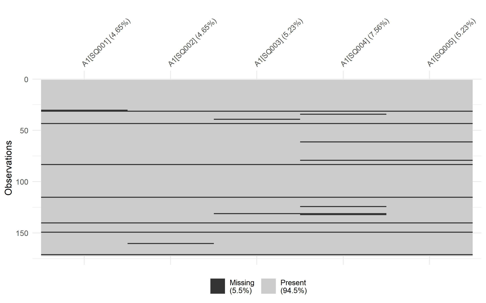<!-- -->

```r
a1_df_rec %>% 
  plot_likert(question_codes, "Practices regarding OS")
```

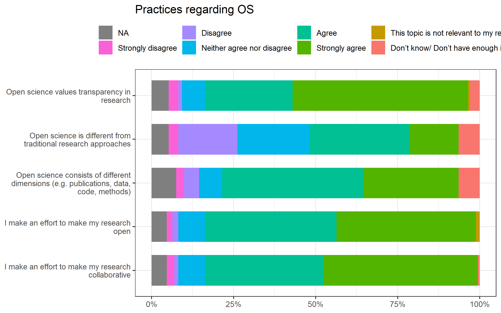<!-- -->


```r
answer_levels_b1_001 <- c("None", "1", "2", "3-5", "more than 5")


b1_001_df <- df %>% 
  select(starts_with("B1[")) 

b1_001_df_rec <- b1_001_df %>% 
  mutate(across(.fns = factor, levels = answer_levels_b1_001))


b1_001_df %>% 
  summarise(across(.fns = ~sum(is.na(.x))))
```

```
## # A tibble: 1 x 11
##   `B1[SQ001]` `B1[SQ002]` `B1[SQ003]` `B1[SQ004]` `B1[SQ005]` `B1[SQ006]`
##         <int>       <int>       <int>       <int>       <int>       <int>
## 1           5           5           5           5           5           5
## # ... with 5 more variables: B1[SQ007] <int>, B1[SQ008] <int>, B1[SQ009] <int>,
## #   B1[SQ010] <int>, B1[SQ013] <int>
```

```r
b1_001_df_rec %>% 
  plot_likert(question_codes, "Attended Training Events")
```

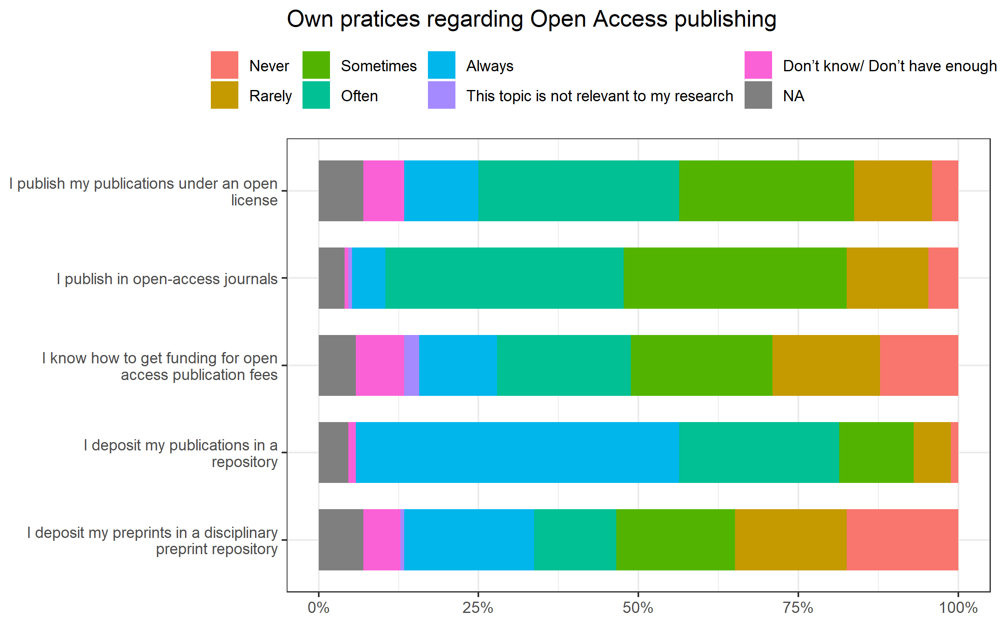<!-- -->


```r
answer_levels_e3 <- c("<20", "20-29", "30-39", "40-49", "50-59", "60-69", "70+")

e3_df <- df %>% 
  select("E3")

e3_df_rec <- e3_df %>% 
  mutate(across(.fns = factor, levels = answer_levels_e3))

# > e3_df %>% mutate(E3 = fct_relevel(fct_reorder(E3, parse_number(E3)), "<20"))


e3_df_rec %>% 
  summarise(across(.fns = ~sum(is.na(.x))))
```

```
## # A tibble: 1 x 1
##      E3
##   <int>
## 1     5
```

```r
e3_df_rec %>% 
  plot_likert(question_codes, "Age cohorts")
```

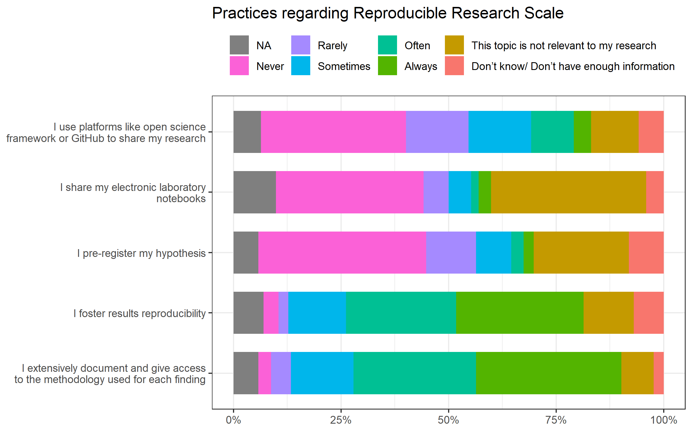<!-- -->

```r
e3_df_rec %>%
  mutate(across(.fns = as.numeric)) %>% 
  summarise(across(everything(), ~mean(.x, na.rm = TRUE)))
```

```
## # A tibble: 1 x 1
##      E3
##   <dbl>
## 1  4.49
```

```r
e3_df_rec %>%
  # mutate(across(.fns = as.numeric)) %>% 
  ggplot(aes(E3)) +
  geom_bar() 
```

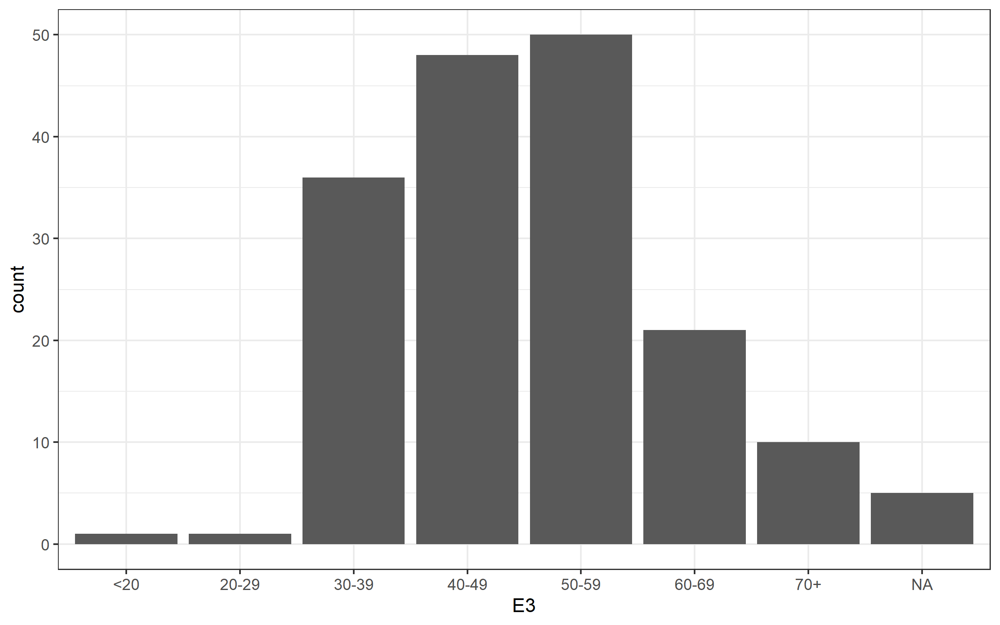<!-- -->

```r
  scale_x_log10()
```

```
## <ScaleContinuousPosition>
##  Range:  
##  Limits:    0 --    1
```


```r
answer_levels_e2 <- c("Man", "Woman", "Prefer not to say", "Other")

e2_df <- df %>% 
  select("E2")

e2_df_rec <- e2_df %>% 
  mutate(across(.fns = factor, levels = answer_levels_e2))

e2_df_rec %>% 
  plot_likert(question_codes, "Gender")
```

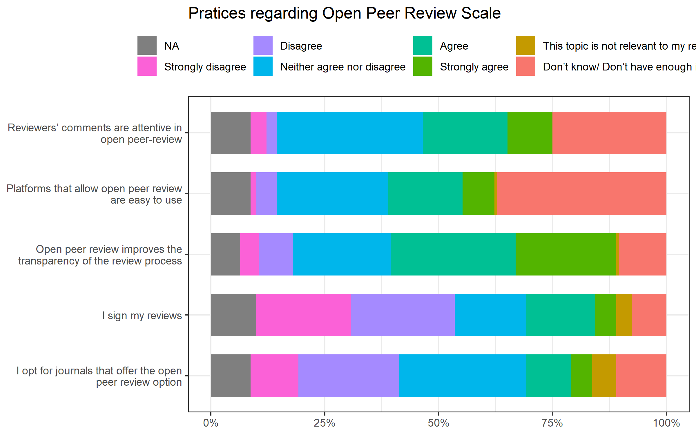<!-- -->


```r
e3b_df <- df %>% 
  select("E3b") %>% 
  filter(E3b > 1960)

e3b_df %>% 
  ggplot(aes(E3b)) +
  geom_histogram()
```

```
## `stat_bin()` using `bins = 30`. Pick better value with `binwidth`.
```

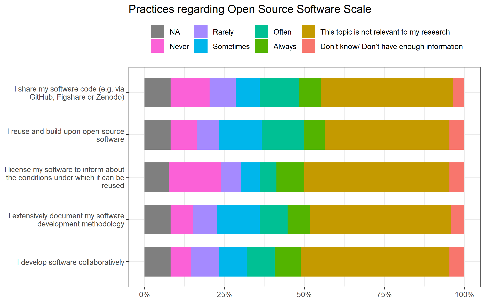<!-- -->


```r
answer_levels_e4 <- c("Post-secondary non-tertiary education (e.g. VET Schools, schools of healthcare and nursing)", "Short-cycle tertiary education (e.g. master schools, colleges, vocational training schools)", "Bachelor or equivalent", "Master or equivalent", "Doctorate or equivalent", "Other")

e4_df <- df %>% 
  select("E4")

e4_df_rec <- e4_df %>% 
  mutate(across(.fns = factor, levels = answer_levels_e4))


e4_df_rec %>%
  plot_likert(question_codes, "Highest education")
```

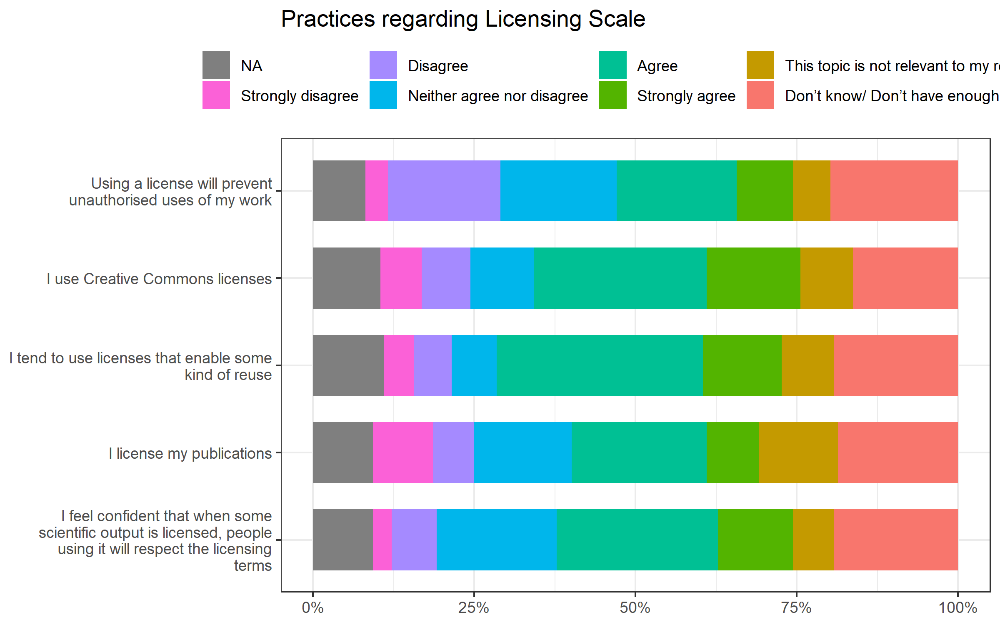<!-- -->

```r
# e4_df_rec %>%  mutate(across(.fns = as.numeric)) %>% ggplot(aes(E4)) + geom_histogram() + scale_x_log10()
```


```r
answer_levels_e5 <- c("University", "Public research institute", "Private research institute", "Company", "Nonprofit", "Other")

e5_df <- df %>% 
  select("E5")

e5_df_rec <- e5_df %>% 
  mutate(across(.fns = factor, levels = answer_levels_e5))


e5_df_rec %>%
  plot_likert(question_codes, "In what type of institution do you work?")
```

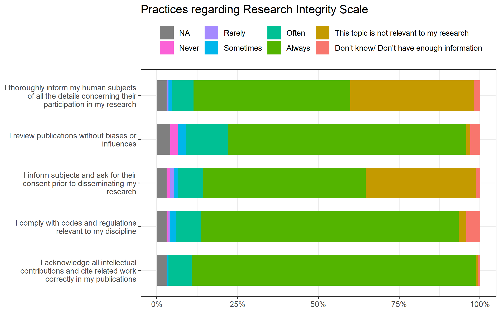<!-- -->


```r
answer_levels_e6 <- c("Junior Researcher", "Senior researcher", "Ph.D. student", "Postdoctoral fellow/researcher", "Assistant professor", 
                      "Associate professor", "Full professor", "Associate research scientist", "Instructor", "Lecturer", "Adjunct professor", 
                      "Technician or lab manager", "Core facility manager", "Other")

e6_df <- df %>% 
  select("E6")

e6_df_rec <- e6_df %>% 
  mutate(across(.fns = factor, levels = answer_levels_e6))


e6_df_rec %>%
  plot_likert(question_codes, "Position")
```

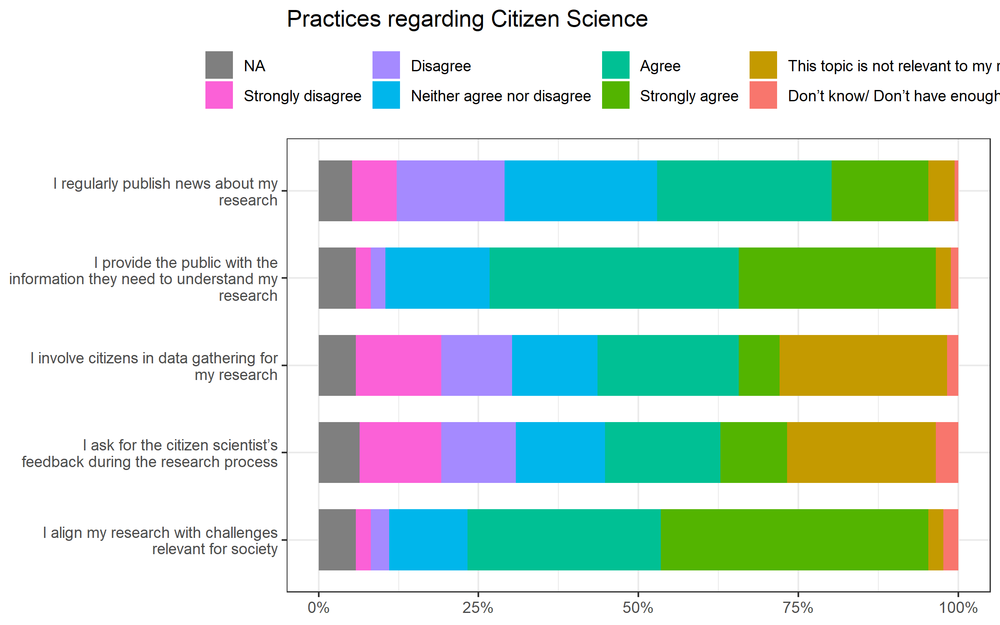<!-- -->


```r
answer_levels_e7 <- c("Natural Sciences", "Engineering and technology", "Medical and health sciences", "Agricultural and Veterinary sciences", 
                      "Social Sciences", "Humanities and the Arts")

e7_df <- df %>% 
  select("E7")

e7_df_rec <- e7_df %>% 
  mutate(across(.fns = factor, levels = answer_levels_e7))


e7_df_rec %>%
  plot_likert(question_codes, "General knowledge area")
```

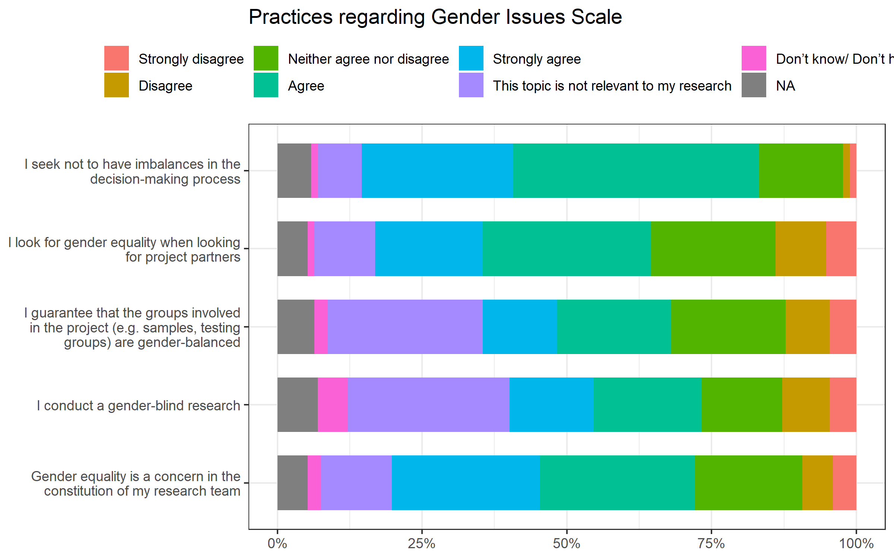<!-- -->

```r
e7_df_rec %>% 
  count(E7) %>% 
  ggplot(aes(fct_reorder(E7, n, .fun = "max"), n)) +
  geom_col(width = .7) +
  coord_flip() +
  labs(x = NULL, title = "Respondents by discipline")
```

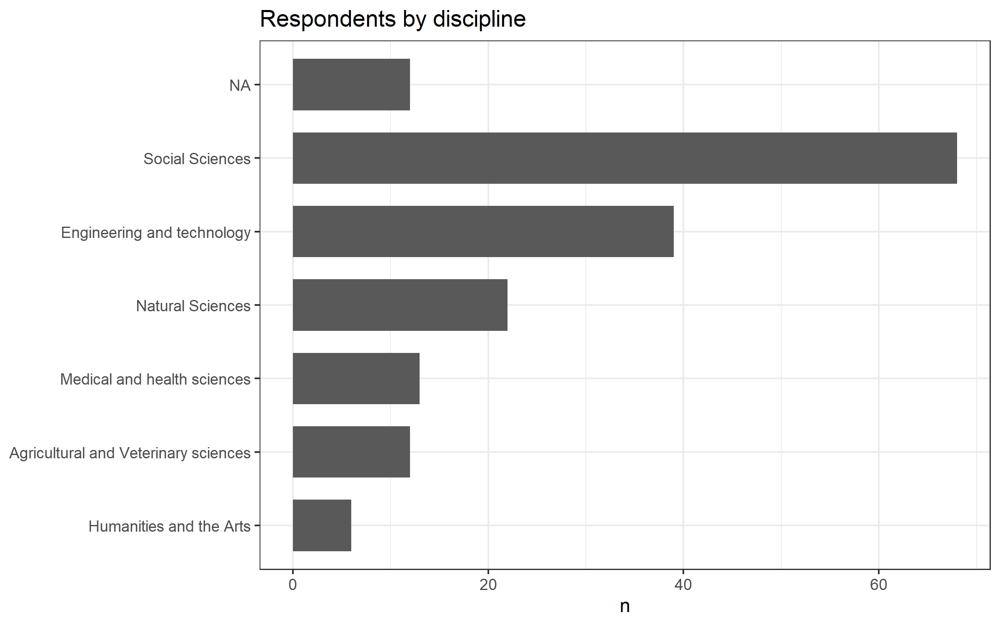<!-- -->


# Further todos

- remove non-consenters
- check out cases with weird first year of publication `df %>% filter(id %in% c(356, 420, 129))` 


