# C1 Institution: OA policy


```r
answer_levels_5 <- c("I don't know", "No", "Yes")

c1_df <- df %>% 
  select("C1")

c1_df_rec <- c1_df %>% 
  mutate(across(.fns = factor, levels = answer_levels_5))


c1_df_rec %>% 
  count(C1) %>% 
  ggplot(aes(fct_reorder(C1, n, .fun = "max"), n)) +
  geom_col(width = .5) +
  coord_flip() +
  labs(x = NULL, title = "Does your institution have an OA policy?")
```

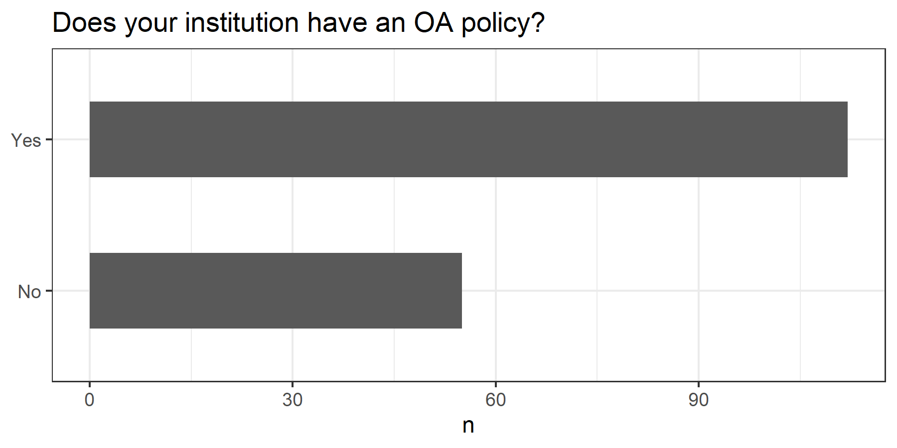<!-- -->

# C3 Institution: OS/OA practices recommandation


```r
answer_levels_6 <- c("No", "Yes")

c3_df <- df %>% 
  select("C3")

c3_df_rec <- c3_df %>% 
  mutate(across(.fns = factor, levels = answer_levels_6))


c3_df_rec %>% 
  count(C3) %>% 
  ggplot(aes(fct_reorder(C3, n, .fun = "max"), n)) +
  geom_col(width = .5) +
  coord_flip() +
  labs(x = NULL, title = "Does your institution recommend open science/ open access practices?")
```

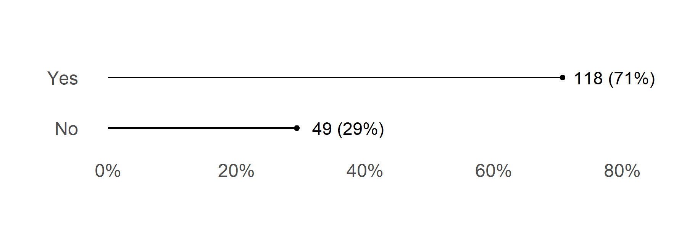<!-- -->

# c5 Helpdesk/group to support any issues


```r
c5_df <- df %>% 
  select("C5")

c5_df_rec <- c5_df %>% 
  mutate(across(.fns = factor, levels = answer_levels_5))


c5_df_rec %>% 
  count(C5) %>% 
  ggplot(aes(fct_reorder(C5, n, .fun = "max"), n)) +
  geom_col(width = .7) +
  coord_flip() +
  labs(x = NULL, title = "Is there a dedicated helpdesk/group\nto support any issues related to the open science/open access policy?")
```

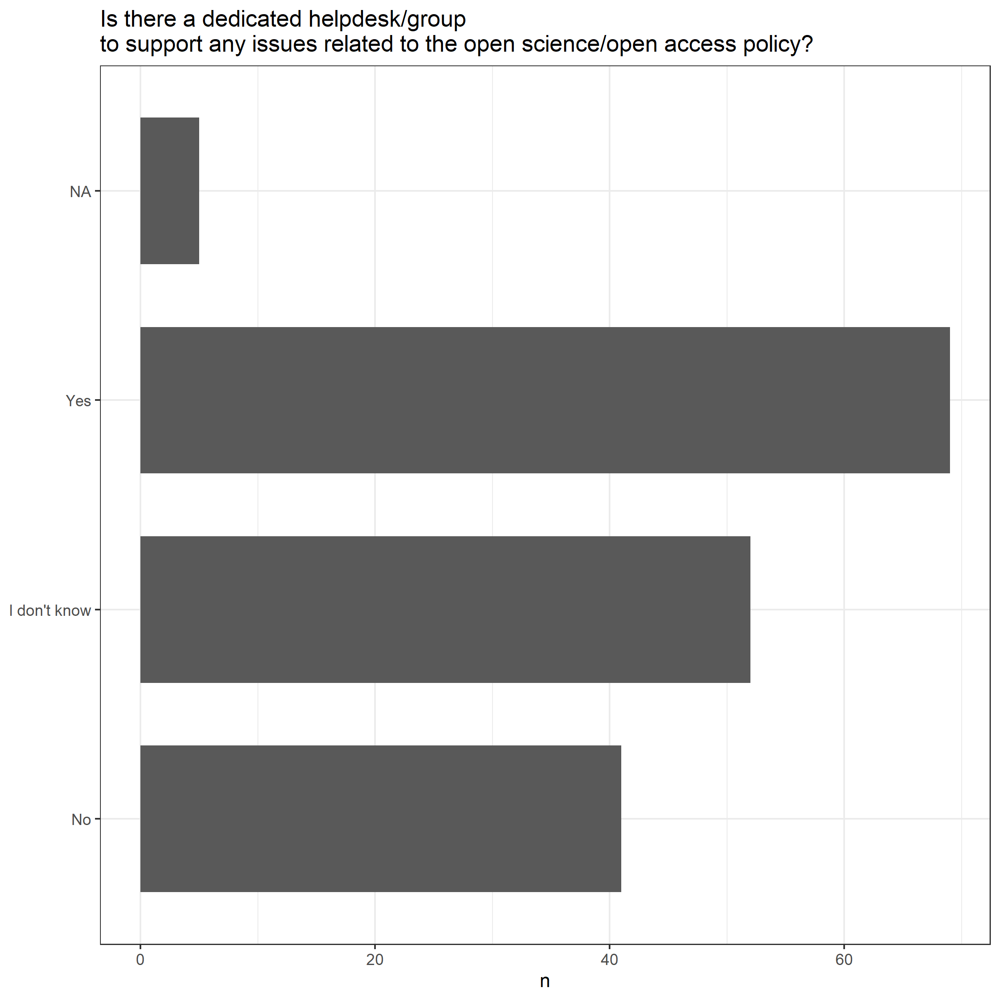<!-- -->


# C6 Guidance on how to comply with the policies by the financing entities that require OA to publications


```r
c6_df <- df %>% 
  select("C6")

c6_df_rec <- c6_df %>% 
  mutate(across(.fns = factor, levels = answer_levels_5))

c6_df %>% 
  summarise(across(.fns = ~sum(is.na(.x))))
```

```
## # A tibble: 1 x 1
##      C6
##   <int>
## 1     3
```

```r
c6_df_rec %>% 
  count(C6) %>% 
  ggplot(aes(fct_reorder(C6, n, .fun = "max"), n)) +
  geom_col(width = .7) +
  coord_flip() +
  labs(x = NULL, title = "Guidance on how to comply with the policies\nby the financing entities that require OA to publications")
```

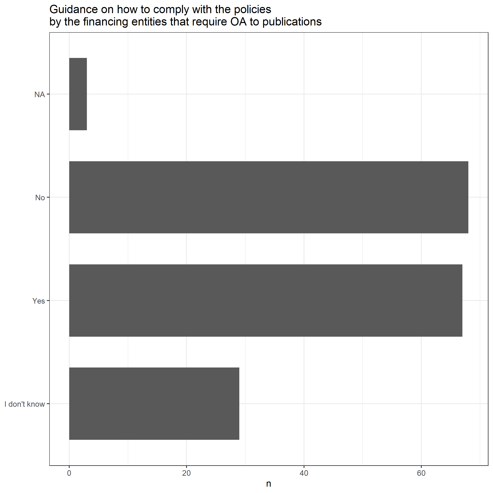<!-- -->

# C7 Financial support in paying article processing charges (APCs)


```r
c7_df <- df %>% 
  select("C7")

c7_df_rec <- c7_df %>% 
  mutate(across(.fns = factor, levels = answer_levels_5))

c7_df %>% 
  summarise(across(.fns = ~sum(is.na(.x))))
```

```
## # A tibble: 1 x 1
##      C7
##   <int>
## 1     4
```

```r
c7_df_rec %>% 
  count(C7) %>% 
  ggplot(aes(fct_reorder(C7, n, .fun = "max"), n)) +
  geom_col(width = .7) +
  coord_flip() +
  labs(x = NULL, title = "Does your institution support you financially in paying article processing charges (APCs)?")
```

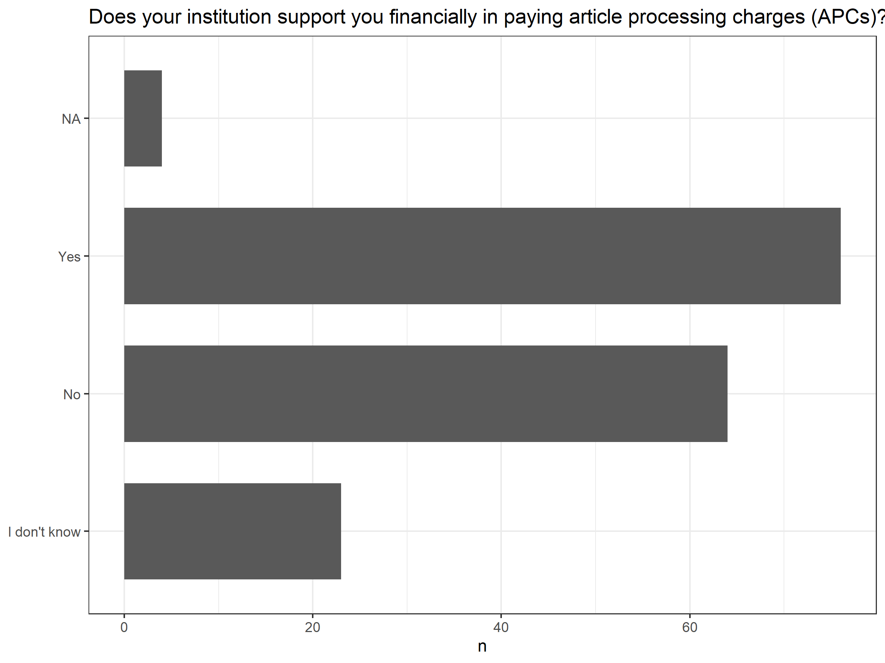<!-- -->


# C8 Degree of support in practicing OS at institution


```r
answer_levels_7 <- c("Don’t know/ Don’t have enough information", "I do not receive any support or incentives", "I do not receive any support or incentives but would like to", "I receive some support or incentives", 
"I receive sufficient support or incentives")

c8_df <- df %>% 
  select(starts_with("C8[")) 

c8_df_rec <- c8_df %>% 
  mutate(across(.fns = factor, levels = answer_levels_7))


c8_df %>% 
  summarise(across(.fns = ~sum(is.na(.x))))
```

```
## # A tibble: 1 x 7
##   `C8[SQ001]` `C8[SQ002]` `C8[SQ003]` `C8[SQ004]` `C8[SQ005]` `C8[SQ006]`
##         <int>       <int>       <int>       <int>       <int>       <int>
## 1           0           0           0           0           0           0
## # ... with 1 more variable: C8[SQ007] <int>
```

```r
c8_df_rec %>% 
  plot_likert(question_codes, "Degree of support in practicing OS at institution")
```

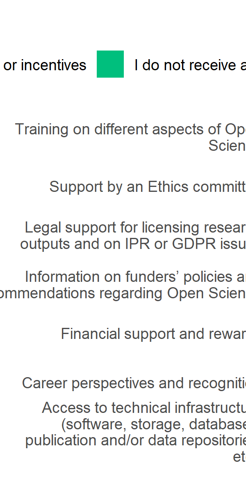<!-- -->


# C10: Other initiatives incentivising Open Science practices at institution


```r
c10_df <- df %>% 
  select("C10")

c10_df_rec <- c10_df %>% 
  mutate(across(.fns = factor, levels = answer_levels_6))

c10_df %>% 
  summarise(across(.fns = ~sum(is.na(.x))))
```

```
## # A tibble: 1 x 1
##     C10
##   <int>
## 1     0
```

```r
c10_df_rec %>% 
  count(C10) %>% 
  ggplot(aes(fct_reorder(C10, n, .fun = "max"), n)) +
  geom_col(width = .5) +
  coord_flip() +
  labs(x = NULL, title = "Other initiatives incentivising Open Science practices at institution")
```

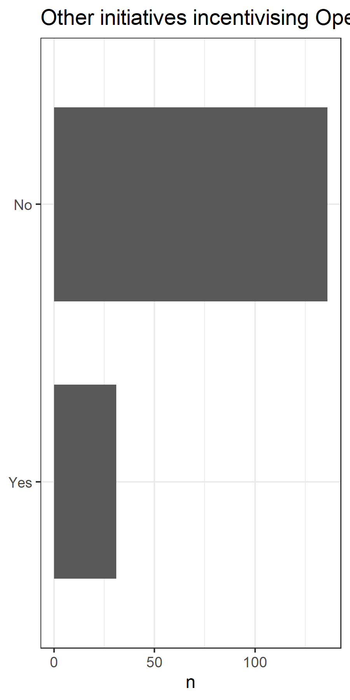<!-- -->

# Part D: Drivers and barriers to practicing Open Science

# D2 Summarised views: What would you say OS is?


```r
d2_df <- df %>% 
  select("D2[SQ001]", "D2[SQ002]", "D2[SQ003]", "D2[SQ004]", "D2[SQ005]", "D2[SQ006]", "D2[SQ007]")

d2_df_rec <- d2_df %>% 
  mutate(across(.fns = factor, levels = answer_levels_6))

d2_df %>% 
  summarise(across(.fns = ~sum(is.na(.x))))
```

```
## # A tibble: 1 x 7
##   `D2[SQ001]` `D2[SQ002]` `D2[SQ003]` `D2[SQ004]` `D2[SQ005]` `D2[SQ006]`
##         <int>       <int>       <int>       <int>       <int>       <int>
## 1           0           0           0           0           0           0
## # ... with 1 more variable: D2[SQ007] <int>
```

```r
d2_df_rec %>% 
  plot_likert(question_codes, "Summarised views: What would you say OS is?")
```

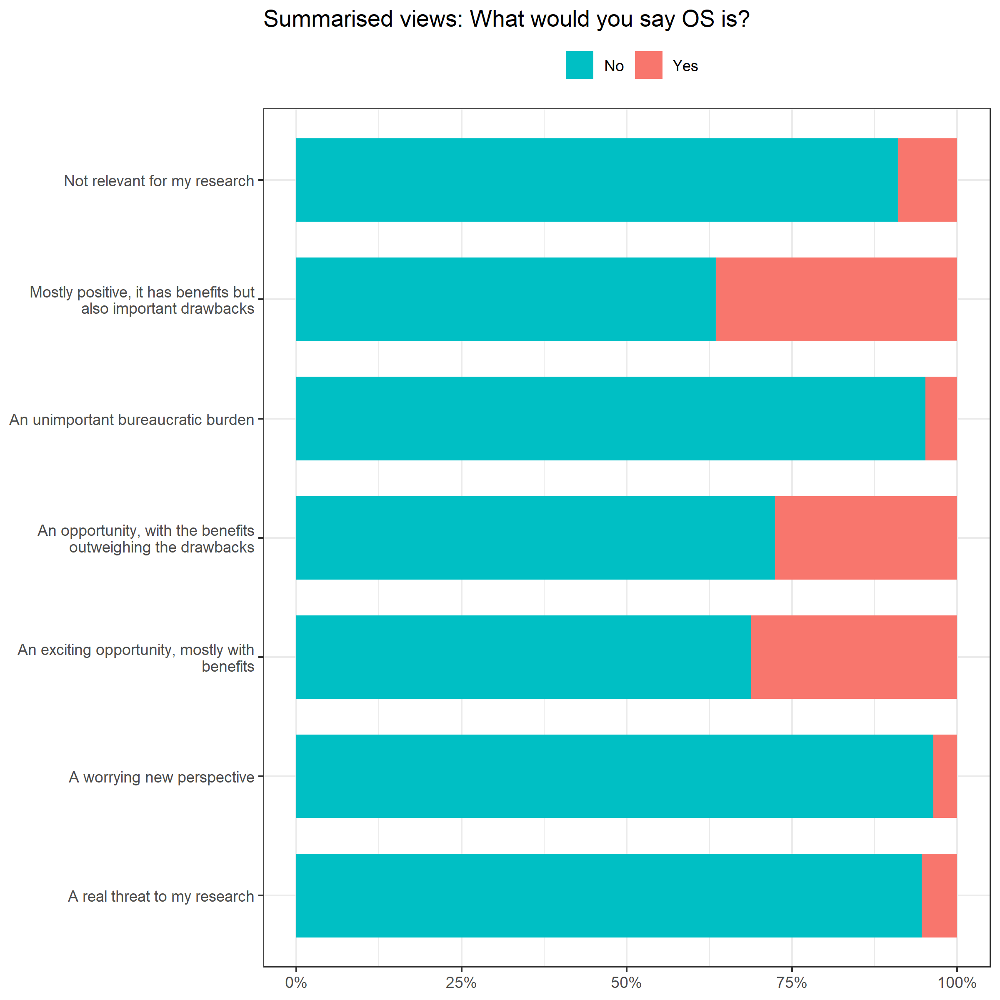<!-- -->

# D3  Most significant barriers facing


```r
answer_levels_8 <- c("Don’t know/ Don’t have enough information", "No barrier", "Minor barrier",
                     "Significant barrier", "Very significant barrier")

d3_df <- df %>% 
  select("D3[SQ001]", "D3[SQ002]", "D3[SQ003]", "D3[SQ004]", "D3[SQ005]", "D3[SQ006]", "D3[SQ007]", "D3[SQ008]")

d3_df_rec <- d3_df %>% 
  mutate(across(.fns = factor, levels = answer_levels_8))

d3_df_rec %>% 
  plot_likert(question_codes, "Which are the most significant barriers you will be facing while\nembracing an Open Science perspective?")
```

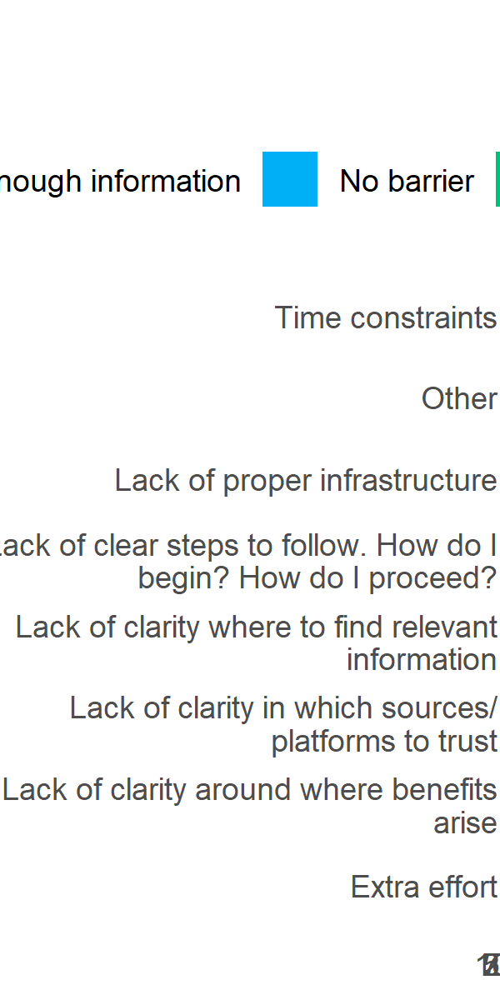<!-- -->

# D5 Main drivers to participate OS


```r
answer_levels_8 <- c("Don’t know/ Don’t have enough information", "No driver", "Minor driver",
                     "Significant driver", "Very significant driver")

d5_df <- df %>% 
  select(starts_with("D5[")) 

d5_df_rec <- d5_df %>% 
  mutate(across(.fns = factor, levels = answer_levels_8))


d5_df %>% 
  summarise(across(.fns = ~sum(is.na(.x))))
```

```
## # A tibble: 1 x 8
##   `D5[SQ001]` `D5[SQ002]` `D5[SQ003]` `D5[SQ004]` `D5[SQ006]` `D5[SQ005]`
##         <int>       <int>       <int>       <int>       <int>       <int>
## 1           0           0           0           0           0           0
## # ... with 2 more variables: D5[SQ007] <int>, D5[SQ008] <int>
```

```r
d5_df_rec %>% 
  plot_likert(question_codes, "Main drivers to participate OS")
```

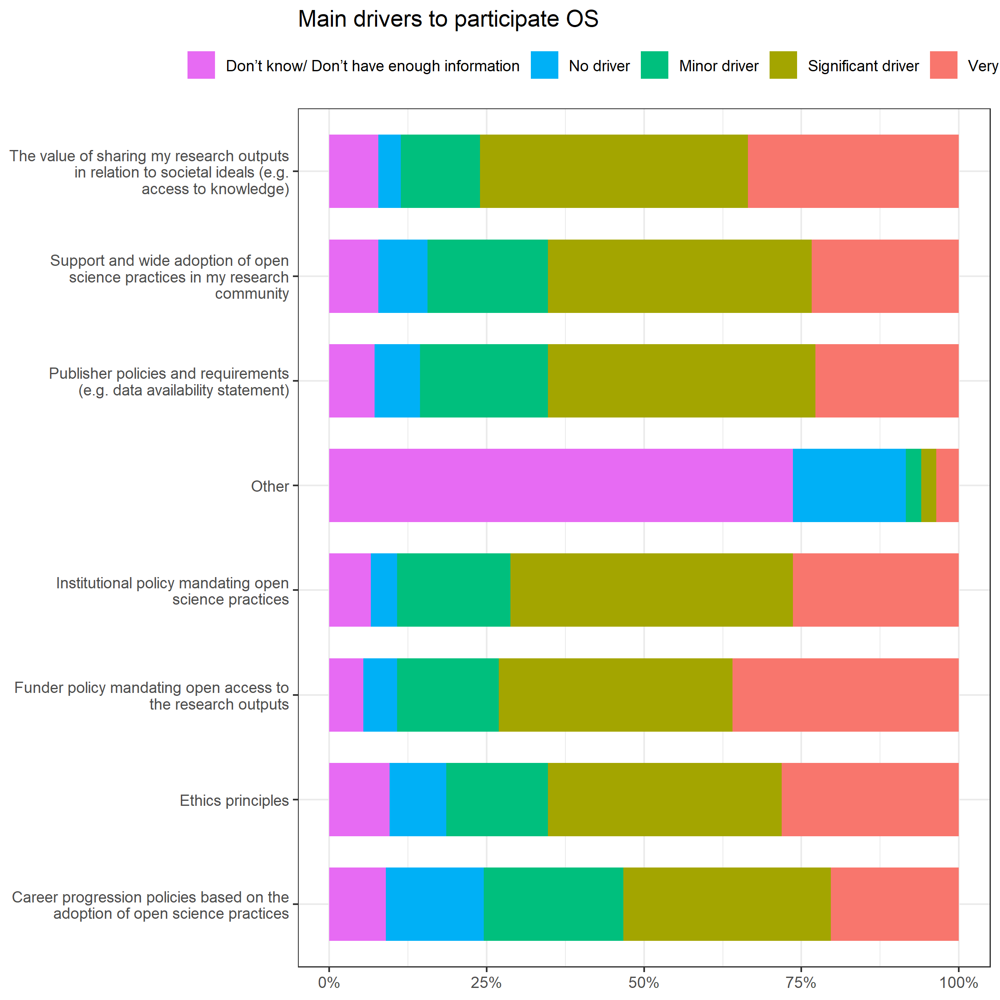<!-- -->

# D7 Drivers or barriers to practice Open Science


```r
answer_levels_9 <- c("Don’t know/ Don’t have enough information", "Barrier", "Neither barrier nor driver",
                     "Driver")

d7_df <- df %>% 
  select(starts_with("D7[")) 

d7_df_rec <- d7_df %>% 
  mutate(across(.fns = factor, levels = answer_levels_9))


d7_df %>% 
  summarise(across(.fns = ~sum(is.na(.x))))
```

```
## # A tibble: 1 x 8
##   `D7[SQ001]` `D7[SQ002]` `D7[SQ003]` `D7[SQ004]` `D7[SQ006]` `D7[SQ005]`
##         <int>       <int>       <int>       <int>       <int>       <int>
## 1           0           0           0           0           0           0
## # ... with 2 more variables: D7[SQ007] <int>, D7[SQ008] <int>
```

```r
d7_df_rec %>% 
  plot_likert(question_codes, "Drivers or barriers to practice Open Science")
```

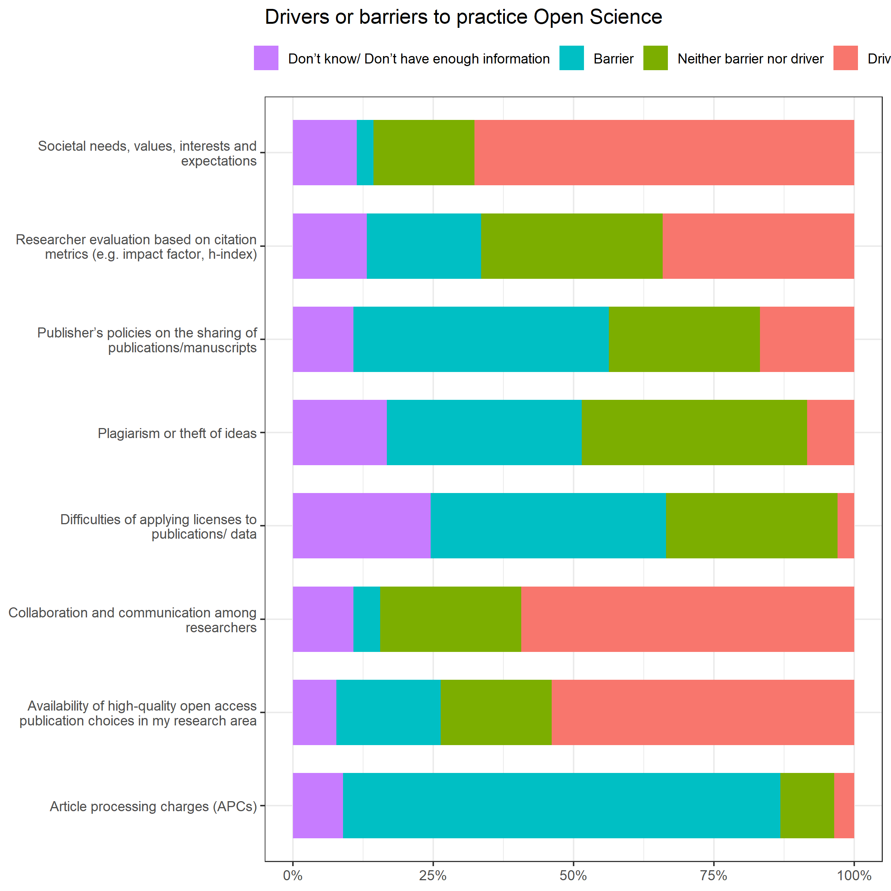<!-- -->
