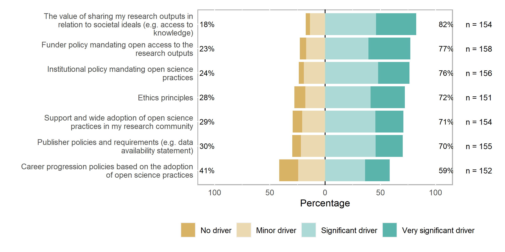

# C1 Institution: OA policy

Does your institution have an open access policy? (Y/N/ I don’t know)


```r
answer_levels_5 <- c("I don't know", "No", "Yes")

c1_df <- df %>% 
  select("C1")

c1_df_rec <- c1_df %>% 
  mutate(across(.fns = factor, levels = answer_levels_5))


c1_df_rec %>% 
  plot_bar(C1, title = "Institution: OA policy", reorder = TRUE, nudge_y = .08)
```

<!-- -->

# C3 Institution: OS/OA practices recommandation

Does your institution recommend open science/ open access practices? (Y/N)


```r
answer_levels_6 <- c("No", "Yes")

c3_df <- df %>% 
  select("C3")

c3_df_rec <- c3_df %>% 
  mutate(across(.fns = factor, levels = answer_levels_6))


c3_df_rec %>% 
  plot_bar(C3, title = "Institution: OS/OA practices recommandation", reorder = TRUE, nudge_y = .08)
```

<!-- -->

# c5 Helpdesk/group to support any issues

Is there a dedicated helpdesk/ group to support any issues related to the open science / open access policy? (Y/N/ I don’t know)


```r
c5_df <- df %>% 
  select("C5")

c5_df_rec <- c5_df %>% 
  mutate(across(.fns = factor, levels = answer_levels_5))


c5_df_rec %>% 
  plot_bar(C5, title = "Helpdesk/group to support any issues", reorder = FALSE, nudge_y = .06)
```

<!-- -->


# C6 Guidance on how to comply with the policies by the financing entities that require OA to publications

Do you receive any guidance on how to comply with the policies issued by the financing entities that require open access to publications, such as the European Commission or the European Research Council? (Y/N/ I don’t know)


```r
c6_df <- df %>% 
  select("C6")

c6_df_rec <- c6_df %>% 
  mutate(across(.fns = factor, levels = answer_levels_5))

c6_df %>% 
  summarise(across(.fns = ~sum(is.na(.x))))
```

```
## # A tibble: 1 x 1
##      C6
##   <int>
## 1     3
```

```r
c6_df_rec %>% 
  plot_bar(C6, title = "Guidance on how to comply with the policies by the financing entities that require OA to publications", reorder = FALSE, nudge_y = .06)
```

<!-- -->

# C7 Financial support in paying article processing charges (APCs)

Does your institution support you financially in paying article processing charges (APCs)? (Y/N/ I don’t know))


```r
c7_df <- df %>% 
  select("C7")

c7_df_rec <- c7_df %>% 
  mutate(across(.fns = factor, levels = answer_levels_5))

c7_df %>% 
  summarise(across(.fns = ~sum(is.na(.x))))
```

```
## # A tibble: 1 x 1
##      C7
##   <int>
## 1     4
```

```r
c7_df_rec %>% 
  plot_bar(C7, title = "Financial support in paying article processing charges (APCs)", reorder = FALSE, nudge_y = .07)
```

<!-- -->


# C8 Degree of support in practicing OS at institution

To what degree are you supported in practicing Open Science at your institution?


```r
answer_levels_7 <- c("Don’t know/ Don’t have enough information", "I do not receive any support or incentives", "I do not receive any support or incentives but would like to", "I receive some support or incentives", 
"I receive sufficient support or incentives")

c8_df <- df %>% 
  select(starts_with("C8[")) 

c8_df_rec <- c8_df %>% 
  mutate(across(.fns = factor, levels = answer_levels_7))


c8_df %>% 
  summarise(across(.fns = ~sum(is.na(.x))))
```

# A tibble: 1 x 7
  `C8[SQ001]` `C8[SQ002]` `C8[SQ003]` `C8[SQ004]` `C8[SQ005]` `C8[SQ006]`
        <int>       <int>       <int>       <int>       <int>       <int>
1           0           0           0           0           0           0
# ... with 1 more variable: C8[SQ007] <int>

```r
c8_df_rec %>% 
  plot_likert()
```


|Variable                                                                                                      |I do not receive any support or incentives |I do not receive any support or incentives but would like to |I receive some support or incentives |I receive sufficient support or incentives |
|:-------------------------------------------------------------------------------------------------------------|:------------------------------------------|:------------------------------------------------------------|:------------------------------------|:------------------------------------------|
|Access to technical infrastructure (software, storage, databases, publication and/or data repositories, etc.) |33 (23%)                                   |18 (13%)                                                     |47 (33%)                             |44 (31%)                                   |
|Career perspectives and recognition                                                                           |61 (45%)                                   |32 (23%)                                                     |31 (23%)                             |13 (9%)                                    |
|Financial support and rewards                                                                                 |54 (39%)                                   |24 (18%)                                                     |45 (33%)                             |14 (10%)                                   |
|Information on funders’ policies and recommendations regarding Open Science                                   |40 (28%)                                   |27 (19%)                                                     |48 (34%)                             |28 (20%)                                   |
|Legal support for licensing research outputs and on IPR or GDPR issues                                        |34 (28%)                                   |22 (18%)                                                     |42 (34%)                             |24 (20%)                                   |
|Support by an Ethics committee                                                                                |33 (24%)                                   |16 (12%)                                                     |41 (30%)                             |46 (34%)                                   |
|Training on different aspects of Open Science                                                                 |43 (32%)                                   |27 (20%)                                                     |47 (35%)                             |18 (13%)                                   |
<!-- -->


# C10: Other initiatives incentivising Open Science practices at institution

Are there other initiatives incentivising Open Science practices at your institution (eg. Open Science cafes, Data champions)? (Y/N)


```r
c10_df <- df %>% 
  select("C10")

c10_df_rec <- c10_df %>% 
  mutate(across(.fns = factor, levels = answer_levels_6))

c10_df %>% 
  summarise(across(.fns = ~sum(is.na(.x))))
```

```
## # A tibble: 1 x 1
##     C10
##   <int>
## 1     0
```

```r
c10_df_rec %>% 
  plot_bar(C10, title = "Other initiatives incentivising Open Science practices at institution", reorder = FALSE, nudge_y = .08)
```

<!-- -->

# Part D: Drivers and barriers to practicing Open Science

# D2 Summarised views: What would you say OS is?

Overall, if you had to summarise your views, what would you say Open Science is?


```r
d2_df <- df %>% 
  select("D2[SQ001]", "D2[SQ002]", "D2[SQ003]", "D2[SQ004]", "D2[SQ005]", "D2[SQ006]", "D2[SQ007]")

d2_df_rec <- d2_df %>% 
  mutate(across(.fns = factor, levels = answer_levels_6))

d2_df %>% 
  summarise(across(.fns = ~sum(is.na(.x))))
```

# A tibble: 1 x 7
  `D2[SQ001]` `D2[SQ002]` `D2[SQ003]` `D2[SQ004]` `D2[SQ005]` `D2[SQ006]`
        <int>       <int>       <int>       <int>       <int>       <int>
1           0           0           0           0           0           0
# ... with 1 more variable: D2[SQ007] <int>

```r
d2_df_rec %>% 
  plot_likert(legend_rows = 1)
```


|Variable                                                      |No        |Yes      |
|:-------------------------------------------------------------|:---------|:--------|
|A real threat to my research                                  |158 (95%) |9 (5%)   |
|A worrying new perspective                                    |161 (96%) |6 (4%)   |
|An exciting opportunity, mostly with benefits                 |115 (69%) |52 (31%) |
|An opportunity, with the benefits outweighing the drawbacks   |121 (72%) |46 (28%) |
|An unimportant bureaucratic burden                            |159 (95%) |8 (5%)   |
|Mostly positive, it has benefits but also important drawbacks |106 (63%) |61 (37%) |
|Not relevant for my research                                  |152 (91%) |15 (9%)  |
<!-- -->

# D3  Most significant barriers facing while embracing an OS perspective

Which are the most significant barriers you will be facing while embracing an Open Science perspective?


```r
answer_levels_8 <- c("Don’t know/ Don’t have enough information", "No barrier", "Minor barrier",
                     "Significant barrier", "Very significant barrier")

d3_df <- df %>% 
  select("D3[SQ001]", "D3[SQ002]", "D3[SQ003]", "D3[SQ004]", "D3[SQ005]", "D3[SQ006]", "D3[SQ007]", "D3[SQ008]")

d3_df_rec <- d3_df %>% 
  mutate(across(.fns = factor, levels = answer_levels_8))

d3_df_rec %>% 
  plot_likert(legend_rows = 1)
```


|Variable                                                         |No barrier |Minor barrier |Significant barrier |Very significant barrier |
|:----------------------------------------------------------------|:----------|:-------------|:-------------------|:------------------------|
|Extra effort                                                     |18 (12%)   |50 (34%)      |47 (32%)            |33 (22%)                 |
|Lack of clarity around where benefits arise                      |43 (29%)   |49 (33%)      |42 (29%)            |13 (9%)                  |
|Lack of clarity in which sources/platforms to trust              |21 (14%)   |37 (25%)      |45 (30%)            |45 (30%)                 |
|Lack of clarity where to find relevant information               |26 (18%)   |46 (31%)      |59 (40%)            |17 (11%)                 |
|Lack of clear steps to follow. How do I begin? How do I proceed? |24 (17%)   |40 (28%)      |52 (36%)            |28 (19%)                 |
|Lack of proper infrastructure                                    |29 (21%)   |35 (26%)      |51 (38%)            |21 (15%)                 |
|Time constraints                                                 |28 (19%)   |40 (27%)      |56 (38%)            |23 (16%)                 |
<!-- -->

# D5 Main drivers to participate OS

What could be the main drivers for you to practice open science?


```r
answer_levels_9 <- c("Don’t know/ Don’t have enough information", "No driver", "Minor driver",
                     "Significant driver", "Very significant driver")

d5_df <- df %>% 
  select(starts_with("D5[")) 

d5_df_rec <- d5_df %>% 
  mutate(across(.fns = factor, levels = answer_levels_9))


d5_df %>% 
  summarise(across(.fns = ~sum(is.na(.x))))
```

# A tibble: 1 x 8
  `D5[SQ001]` `D5[SQ002]` `D5[SQ003]` `D5[SQ004]` `D5[SQ006]` `D5[SQ005]`
        <int>       <int>       <int>       <int>       <int>       <int>
1           0           0           0           0           0           0
# ... with 2 more variables: D5[SQ007] <int>, D5[SQ008] <int>

```r
d5_df_rec %>% 
  plot_likert(legend_rows = 1)
```


|Variable                                                                                           |No driver |Minor driver |Significant driver |Very significant driver |
|:--------------------------------------------------------------------------------------------------|:---------|:------------|:------------------|:-----------------------|
|Career progression policies based on the adoption of open science practices                        |26 (17%)  |37 (24%)     |55 (36%)           |34 (22%)                |
|Ethics principles                                                                                  |15 (10%)  |27 (18%)     |62 (41%)           |47 (31%)                |
|Funder policy mandating open access to the research outputs                                        |9 (6%)    |27 (17%)     |62 (39%)           |60 (38%)                |
|Institutional policy mandating open science practices                                              |7 (4%)    |30 (19%)     |75 (48%)           |44 (28%)                |
|Publisher policies and requirements (e.g. data availability statement)                             |12 (8%)   |34 (22%)     |71 (46%)           |38 (25%)                |
|Support and wide adoption of open science practices in my research community                       |13 (8%)   |32 (21%)     |70 (45%)           |39 (25%)                |
|The value of sharing my research outputs in relation to societal ideals (e.g. access to knowledge) |6 (4%)    |21 (14%)     |71 (46%)           |56 (36%)                |
<!-- -->

# D7 Drivers or barriers to practice Open Science

Would you say the following factors are drivers or barriers for you to practice Open Science?


```r
answer_levels_9 <- c("Don’t know/ Don’t have enough information", "Barrier", "Neither barrier nor driver",
                     "Driver")

d7_df <- df %>% 
  select(starts_with("D7[")) 

d7_df_rec <- d7_df %>% 
  mutate(across(.fns = factor, levels = answer_levels_9))


d7_df %>% 
  summarise(across(.fns = ~sum(is.na(.x))))
```

# A tibble: 1 x 8
  `D7[SQ001]` `D7[SQ002]` `D7[SQ003]` `D7[SQ004]` `D7[SQ006]` `D7[SQ005]`
        <int>       <int>       <int>       <int>       <int>       <int>
1           0           0           0           0           0           0
# ... with 2 more variables: D7[SQ007] <int>, D7[SQ008] <int>

```r
d7_df_rec %>% 
  plot_likert(legend_rows = 1)
```


|Variable                                                                         |Barrier   |Neither barrier nor driver |Driver    |
|:--------------------------------------------------------------------------------|:---------|:--------------------------|:---------|
|Article processing charges (APCs)                                                |130 (86%) |16 (11%)                   |6 (4%)    |
|Availability of high-quality open access publication choices in my research area |31 (20%)  |33 (21%)                   |90 (58%)  |
|Collaboration and communication among researchers                                |8 (5%)    |42 (28%)                   |99 (66%)  |
|Difficulties of applying licenses to publications/ data                          |70 (56%)  |51 (40%)                   |5 (4%)    |
|Plagiarism or theft of ideas                                                     |58 (42%)  |67 (48%)                   |14 (10%)  |
|Publisher’s policies on the sharing of publications/manuscripts                  |76 (51%)  |45 (30%)                   |28 (19%)  |
|Researcher evaluation based on citation metrics (e.g. impact factor, h-index)    |34 (23%)  |54 (37%)                   |57 (39%)  |
|Societal needs, values, interests and expectations                               |5 (3%)    |30 (20%)                   |113 (76%) |
<!-- -->
